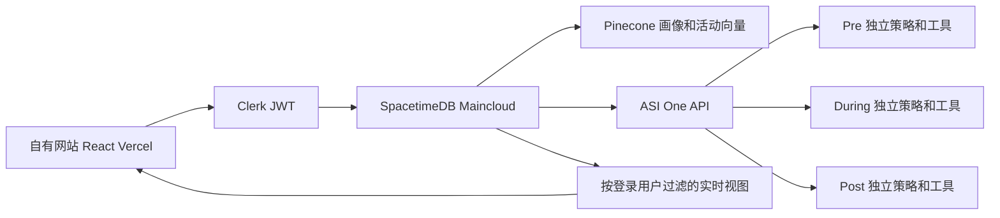

# 活动与站内助手实施说明

本说明对应 `feat/live-map-spacetimedb` 的活动与助手实现。新开发者可以按本文理解数据、复现业务流程并发布现有云端系统。功能实现前的目录和历史路径分析保留在 [项目架构与需求双向核对](项目架构与需求双向核对.md)。本文覆盖本次用户明确要求的活动邀请、全员比较、站内聊天、GPS 提醒和连接处理。

网站入口是 [画像页面](https://mhacks-live-map.vercel.app/chat) 和 [活动与助手](https://mhacks-live-map.vercel.app/events)。所有业务和私人状态保存在 SpacetimeDB Maincloud 的 `mhacks-live-map`，Vercel 项目 `mhacks-live-map` 提供前端。ASI:One 和 Pinecone 由后端调用；浏览器不接触它们的 API key。

## 1 本次需求与实现核对

| 用户需求 | 实现位置 | 行为与验收依据 |
| --- | --- | --- |
| Terry 添加活动、发布 invitation | `NetworkingWorkspace.tsx` 管理员表单；`createNetworkingEvent` | 只有 `cloud_admin` 中的登录身份可创建；修改显示名不授予权限 |
| 点击邀请加入，Start 后停止加入 | `joinNetworkingEvent`、`startNetworkingEvent` | 开始前可加入或退出；开始事务冻结成员及画像；开始后禁止加入和退出 |
| Pre 在全员向量之间比较 | `prepareNetworkingEvent` | 写活动 namespace，对每人调用 Pinecone query；保存每个有向组合的排序，排除自己 |
| 先显示 5 或 10 人，继续加载 | `getEventInterestList`、网站 interest list | 完整名单保留在数据库；首屏选择 5/10，Load more 分页；过滤当前隐藏用户 |
| 三个独立 Agent 在自己的网站聊天 | `assistantAgents.ts`、`sendAssistantMessage` | 三份角色策略和工具权限，按用户、活动、阶段隔离历史；全部对话调用 ASI:One API |
| During 管理 interest list 与星标 | `setEventStar`、During 读取工具 | 当前画像由 SpacetimeDB 提供；列表来自活动开始时的快照，星标单独保存 |
| 地图上关注对象靠近时提醒 | `updateEventLocation`、`notifyNearby`、`EventGpsMap.tsx` | 活动内自愿共享位置；前十推荐和全部星标对象符合距离、精度、时效与状态条件后提醒 |
| 连接请求、接受、拒绝 | During 的请求和响应工具、私人通知 | 网站按钮也发送 ASI 对话请求；工具执行后更新数据库，只有接收方能答复 |
| Post 保留草稿，增加交互界面 | Post 会话和私人草稿卡片 | accepted/recorded 连接才可生成；渠道、时间和草稿可读，用户复制后自行发送 |

以上需求已由用户明确提出。本次选择的 100 米距离、两分钟位置时效、前十监测与五分钟提醒间隔是实现默认值；它们是源码中的产品规则，不是用户声称的现场测量结果。

“独立 Agent”在当前网页中具体指独立角色策略、工具集合和会话记录，由同一 SpacetimeDB 服务承载。用户已将交互入口明确改为自己的网站和 ASI:One API，因此网页不要求用户进入 ASI 网站，也不依赖 Agentverse mailbox。旧 Python/uAgents 文件保留；本次没有声称它们已经注册为在线 Agentverse Agent。

## 2 用户实际操作

### 2.1 Terry 发布活动

1. 用已获授权的 Terry 账号登录。管理员权限由数据库身份允许名单决定。
2. 打开 `/events`，填写 Event title、Venue、Date and time、Invitation description。
3. 点击 Publish invitation。活动出现在公开 invitation 列表，状态为 OPEN INVITATION。
4. 点击 Copy invitation link，得到 `/events?event=<eventId>`。任何人都能查看邀请；参加者需要登录并完成画像向量索引。
5. 等参加者加入后点击 Start event and lock roster。此操作立即停止新加入，再开始批量准备匹配。
6. 页面显示已准备人数。失败时保留已完成名单，点击 Resume preparing matches 继续，不需要重新开放报名。

时间字段用于显示活动安排；真正关闭报名的触发条件是管理员按 Start。当前没有自动定时开始、取消或结束活动的页面。

### 2.2 参加者建立画像并加入

1. 打开 `/chat`，上传简历或填写 introduction。ASI 提取事实，Pinecone 生成并保存 1024 维向量，SpacetimeDB 保存自己的结构化画像。
2. 打开 invitation 链接，点击 Join event。向量未完成时页面引导返回 My profile。
3. 活动未开始时可以 Leave event。活动开始后看到冻结名单状态。
4. Pre 页面先显示五名推荐，可切换十名，并加载更多。只有同一活动内允许被发现的参与者会出现；已隐藏的人不会通过列表暴露。
5. 在 Pre 聊天准备介绍、解释推荐或请助手星标指定的人。

加入活动意味着同意向该活动成员展示姓名和 headline，用于推荐；精确 GPS 需要另外点击 Share event GPS。完整简历、聊天和向量不公开。

### 2.3 During 现场使用

1. 切换 During，选择 Area 和 Availability，点击 Check in。
2. 可手动星标，也可通过聊天让助手设置星标。
3. 点击 Share event GPS，允许浏览器位置权限。地图显示本活动当前准确且新鲜的位置，并用星号标注关注对象。
4. 推荐前十人或星标对象满足靠近条件时，私人 Notifications 收件箱收到提醒。
5. 点击 Request connection 或直接告诉 During 助手要联系谁。接收方在自己的会话或通知中 Accept / Decline。
6. 点击 Stop sharing GPS、Check out、离开页面或断开数据库连接后撤销位置。浏览器崩溃等未及时断线时，服务器会在最后更新两分钟后清除。

浏览器通知是额外的可选渠道，点击 Enable browser notifications 授权后，页面开启时收到即时通知。网站收件箱始终保存通知；没有实现网页关闭后的 Web Push 服务。

### 2.4 Post 跟进

切换 Post，查看已接受的连接，点击 Prepare follow-up 或在聊天中提出同样请求。助手通过工具调用既有草稿生成流程。页面显示自己的私人草稿、双方允许的渠道和建议时间；Copy draft 只复制文字，不表示发送、送达或对方阅读。

## 3 架构与代码入口



| 文件 | 职责 |
| --- | --- |
| `map/src/NetworkingWorkspace.tsx` | 公开邀请、管理员表单、阶段切换、匹配分页、聊天、通知、连接和 Post 草稿 |
| `map/src/EventGpsMap.tsx` | 活动地图、显式 GPS 权限、位置更新、停止共享和过期坐标过滤 |
| `map/spacetimedb/src/index.ts` | 身份授权、所有新增数据表与业务接口、Pinecone 调用、ASI 工具循环、位置调度清理 |
| `map/spacetimedb/src/assistantAgents.ts` | 三个助手的角色提示、允许调用的工具和共同约束 |
| `map/spacetimedb/src/networking.ts` | 既有 ROI 启发式算法，与 Python 版本保持一致 |
| `map/src/module_bindings/` | CLI 自动生成的前端契约；修改模块后必须重新生成 |
| `agents/spacetime-gateway/test/module.test.ts` | 原生业务权限、状态和外部接口隔离回归测试 |
| `agents/spacetime-gateway/test/networking-integration.ts` | 启动真实本地 SpacetimeDB，三个合成登录身份验证实际订阅、调度和权限 |
| `map/test/networking-workspace.test.tsx` | 页面加入、推荐分页、星标和聊天失败重试交互 |

`/events` 与 `/assistant` 使用同一工作区，可传 `event` 和 `stage=pre|during|post`。原 `/chat` 仍负责画像录入，并提供活动入口。旧 `CloudNetworking.tsx` 没有删除，但不再作为该页面的当前人员匹配入口。

## 4 活动名单与全员比较

活动状态是 `open -> started`，匹配状态是 `waiting -> pending -> ready`。管理员开始操作在一个事务中检查所有成员画像、写入快照并冻结名单；检查失败不冻结半份名单。用户后续更新简历不会改变这个活动已经冻结的比较依据。

`prepareNetworkingEvent` 将快照向量每五十个一批写入 `networking-<eventId>` namespace，再对每名参与者查询该 namespace。每次 procedure 最多准备十个人，结果逐人落库。三分钟处理租约防止管理员同时启动两个准备流程；发生失败可从尚未完成的名单继续。

有 n 个成员时，每人有 n-1 个候选，总共保存 n(n-1) 个有向比较。Pinecone 返回的 score 用于语义相似度；索引尚未可读、没有返回某人或超过 query 的 10000 个候选上限时，用数据库快照向量的精确 cosine 补齐，因此不会把“没检索到”当成“没有比较”。候选得分截断为 0 至 1。

排序显示的 Fit 分数采用以下启发式权重：65% 语义相似度，加 35% 目标、技能和资历组合；后者内部权重为 50%、25%、25%。最终乘以 100 并保留一位小数。旧 ROI 算法同时保留，表示预计交谈价值与成本；它不是财务投资回报，也不是证明能获得工作机会的概率。

分页只影响发送给浏览器的数量。完整排序保存在 `event_interest_list.itemsJson`。每次读取再次检查目标成员当前是否 discoverable，并附上实时区域、活动状态、星标及可验证的距离。开始前尚无排名，页面解释名单仍开放；零人或一人的活动不会凭空生成推荐。

这条流程需要保存完整的平方数量比较，因此不宜直接声称已验证万人规模。现有测试验证八人成对排序与分页、三账号真实数据库流程；大活动需要另做容量、费用和处理延迟测量。

## 5 私人数据与实时视图

新增底层表均为私有表。业务参数的 userId 从可信登录身份解析，前端不能任意指定“当前用户”。复用现有 Clerk issuer、JWT audience、`agent_user_link` 和 `cloud_admin`。

| 表 | 主要内容 |
| --- | --- |
| `networking_event` | 活动信息、状态、管理员、人数、向量准备标记和处理租约 |
| `networking_member` | 活动与用户键、加入时间、冻结画像、discoverable、区域、活动状态和更新时间 |
| `event_interest_list` | 本人活动内完整推荐排序 |
| `event_star` | 本人活动内的目标星标 |
| `event_location` | 显式共享的活动 GPS 与精度、更新时间 |
| `event_location_expiry` | 最后更新两分钟后的服务端定时清理任务 |
| `assistant_message` | 本人、活动、阶段的 user / assistant 历史 |
| `assistant_notification` | 私人提醒、连接请求、连接回复及已读状态 |
| `assistant_turn` | 请求 ID、输入、状态、已执行工具与结果，支撑安全重试 |

公开 `networking_invitations` 只投影邀请和准备进度。`my_networking_memberships` 不返回冻结画像。`my_event_stars`、`my_assistant_messages`、`my_assistant_notifications` 仅返回本人数据。`my_event_map_pins` 只返回自己已加入活动中允许被发现且准确的位置。SpacetimeDB 的 view 被标为 public 表示客户端可订阅，函数内部仍按调用者过滤；不等于所有用户能看到同一内容。

账号删除沿用既有外部向量优先删除流程，并扩展到活动 namespace、成员快照、位置及调度、星标、通知、会话、工具请求和其他人的推荐引用。因用户主动删除账号减少成员，是名单冻结规则的隐私例外。

## 6 助手与用户交互

每个助手读取本人画像、当前活动、本人会员状态、前十推荐和自己的活动连接，最近十二条该阶段历史。完整向量不发给聊天模型。其他人的简历、私人目标和聊天不作为对话上下文。

| 助手 | 可以调用的工具 | 用户例子 |
| --- | --- | --- |
| Pre | `get_interest_list`、`set_star` | “我想找创业伙伴，优先聊谁？”、“把这个人加星标” |
| During | 上述工具、`get_connections`、`request_connection`、`respond_connection` | “关注的人谁在附近？”、“给 Alice 发连接请求”、“拒绝这条请求” |
| Post | `get_connections`、`prepare_followup` | “帮我给这位已连接的人准备跟进”、“把措辞改得自然一些” |

网站调用 `sendAssistantMessage`，后端向 `https://api.asi1.ai/v1/chat/completions` 发送 model `asi1`、messages 和该阶段 tools。最多执行三轮工具调用，再取得最终文字回复。工具输出写回模型后才能确认操作结果；工具权限、活动范围和目标身份由服务器再次检查，模型不能靠文本授权越权操作。

聊天请求带唯一 requestId。同一个输入重试复用 requestId，已经完成则返回旧结果；已经成功执行的工具结果单独保存并复用，防止 ASI 最终回复失败后再次发送连接或重复动作。一个用户同时只允许一条正在处理的对话。API 错误会显示在页面，输入保留供重试，不能以虚构成功回复替代。

连接和草稿卡片按钮也进入 ASI 请求路径。活动 CRUD、GPS 上传、星标按钮和读通知仍是确定性的数据库操作，无需为每次定位更新调用模型。靠近提醒由 During 使用的服务端业务逻辑计算并保存，以确保位置和权限规则可验证。

同一活动、同一对用户最多建立一条请求，无论谁先发起。请求状态为 `requested -> accepted|declined`。只有目标用户能答复，拒绝不会建立连接，也不会自动重复请求。Post 计划键包含 eventId，避免不同活动之间复用旧草稿。

## 7 GPS 与通知规则

附近提醒同时满足：双方属于该活动且 discoverable；双方空闲状态为 free；双方活动签到在最近五分钟更新；双方 GPS 最近两分钟更新、精度均不超过 100 米；Haversine 距离不超过 100 米。被提醒对象属于本人的前十推荐或任意星标对象。相同目标至少五分钟后才可再次提醒；已有该活动请求、接受或拒绝状态则不重复推送靠近提醒。

网站在可见页面每三十秒续签到，GPS 约每二十秒确认一次静止位置，发送更新至少间隔五秒。退出、隐藏或停止定位都会撤销位置；SpacetimeDB 的断线处理和定时任务负责页面无法正常清理的情况。当前网页保持打开时支持浏览器 Notification；关闭网页后的推送不在本次实现中。

手机浏览器需要 HTTPS 和用户定位授权。室内 GPS 的误差可能超出阈值，页面会提示精度不足并停用靠近提醒；Area 标签仍能帮助找人。系统没有宣称提供室内高精度定位、持续后台追踪或行走导航。

## 8 原生接口契约

| 接口 | 类型 | 参数与结果要点 |
| --- | --- | --- |
| `networking_account_status` | procedure | 本人 user_id、is_admin、profile_ready；不返回管理员配置 |
| `create_networking_event` | procedure | title、description、venue、startAtMs；管理员；返回 event_id |
| `join_networking_event` / `leave_networking_event` | reducer | eventId；只允许 open 状态 |
| `start_networking_event` | reducer | eventId；管理员；冻结全部成员和画像 |
| `prepare_networking_event` | procedure | eventId；管理员；返回匹配状态、已完成和总人数 |
| `get_event_interest_list` | procedure | eventId、offset、limit 1 至 50；本人名单与过滤后 total |
| `set_event_star` | reducer | eventId、targetId、starred；目标必须是同活动可发现成员 |
| `set_event_availability` | reducer | eventId、zoneId、availabilityStatus、discoverable |
| `update_event_location` / `stop_event_location` | reducer | 本人的 eventId、坐标和 accuracyMeters；停止只需 eventId |
| `request_event_connection` / `respond_event_connection` | reducer | 当前活动目标或请求 ID；服务器检查接收方权限；供助手工具执行 |
| `send_assistant_message` | procedure | eventId、stage、message、requestId；返回 reply、actions、agent、stage、event_id |
| `mark_assistant_notification_read` | reducer | 本人 notificationId；其他人不能读取或标记 |

procedure 字符串结果使用 JSON；reducer 失败由 SDK 返回错误。接口可从生成的 camelCase bindings 调用，不手工拼 SDK 表结构。

## 9 验证与发布步骤

本次新增与既有相关测试合计：前端 20 项、原生模块和评分 41 项；真实本地 SpacetimeDB 使用三个合成账号验证管理员、冻结、全员比较、私人视图、GPS 通知、请求权限、三个阶段历史、跟进、停止定位、断线及实际 scheduler 执行。测试没有操作他人的真实账号。

真实数据库集成使用临时 issuer、合成画像和外部 provider adapter，因为原生 HTTP 客户端禁止访问本地私网 mock 服务。它证明真实数据库行为，不代表访问过真实 ASI/Pinecone；生产 provider 另外用 Maincloud 管理员探针与网站聊天验收。没有宣称已组织两名真人在现场验证手机 GPS。

常规检查：

```powershell
# map 目录
npm.cmd test -- --maxWorkers=1
npm.cmd run build

# agents/spacetime-gateway 目录
npm.cmd test
npm.cmd run typecheck
# 配置 SPACETIME_CLI 和 SPACETIME_STANDALONE 为本机 CLI / standalone 路径后
npm.cmd run test:networking

# 仓库根目录
spacetime generate --lang typescript --out-dir map/src/module_bindings --module-path map/spacetimedb --yes
```

运行完整数据库集成需安装支持 TypeScript 的 SpacetimeDB CLI 与 standalone，测试自动创建隔离目录、账号和数据库并清理，不读取生产 keys。不能把测试夹具 reducer 加入正式模块。

发布顺序按仓库 AGENTS.md：先检查文件和 secrets，提交并 push 当前分支，核对远端 HEAD；然后保留数据发布 Maincloud，再部署 Vercel：

```powershell
spacetime publish mhacks-live-map --server maincloud --module-path map/spacetimedb --delete-data=never --yes
npx.cmd --yes vercel --prod --yes
spacetime call mhacks-live-map verify_cloud_providers --server maincloud --yes
```

线上检查必须看到 Vercel READY、公开 `/events` 返回新页面、Terry 账号出现管理员表单；邀请发布、加入、开始、准备进度和三个助手必须实际运行。ASI/Pinecone 配置存在不等于当前可用。现场 GPS 和网页关闭后的行为按第 7 节边界判断，不把单元测试当成真人现场效果证据。

Terry 当前账号已在 Maincloud 授予管理员身份；未来更换 Clerk issuer / subject 会产生不同 SpacetimeDB 身份，需由现有管理员核对实际登录身份后重新授权。禁止按姓名自动提权，禁止把服务端 keys 放进任何 `VITE_` 环境变量。
