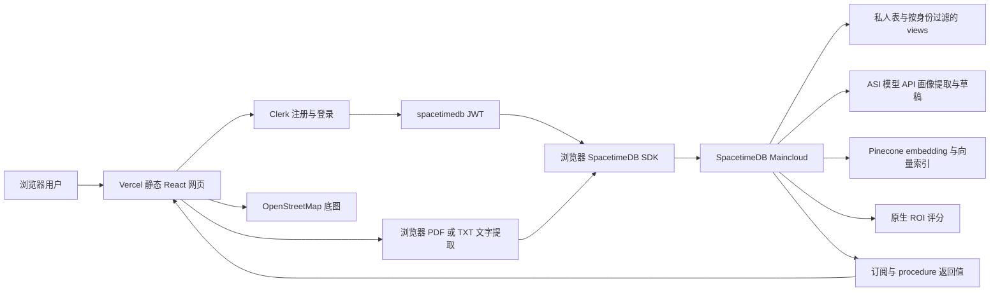
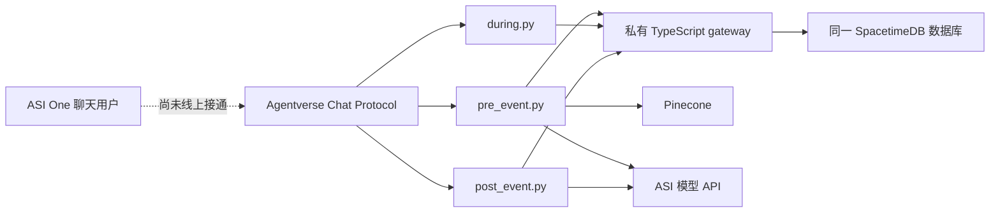
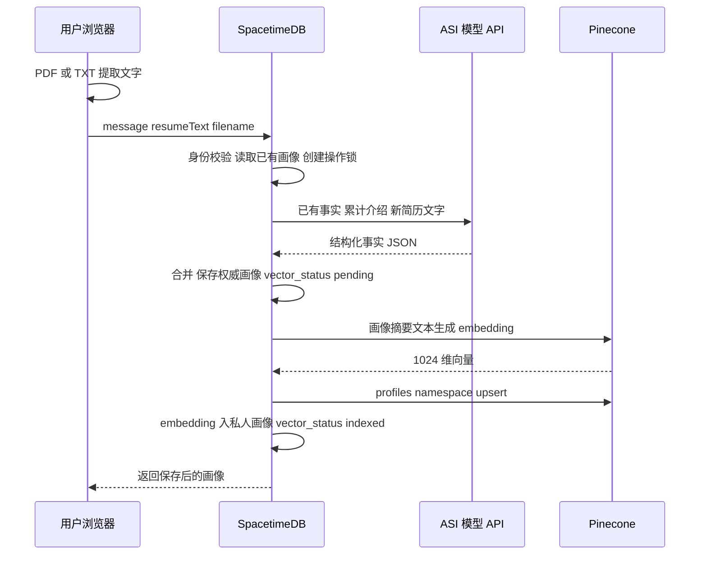
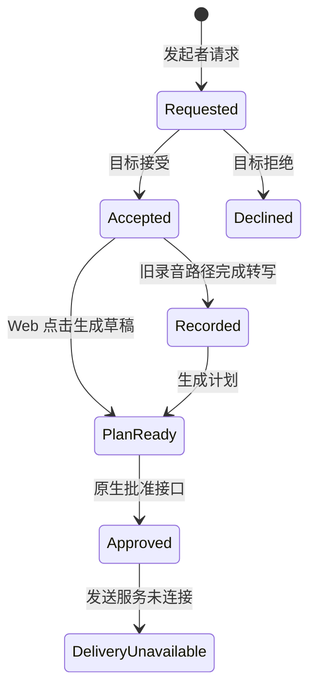
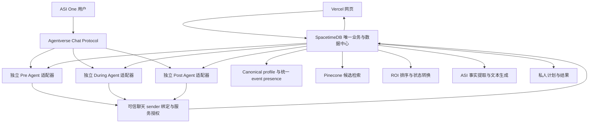

# Networking 项目架构与需求双向核对

本文保留功能实现前的架构审查，面向新加入的开发者、产品负责人和验收人员。**当前实现请先读 [活动与站内助手实施说明](活动与站内助手实施说明.md)**；下文第 1 至 19 节是固定在 `689a6814f564e5ae4ef5f03fae13560850a9a6f6` 的历史基线，其中“当前”“未实现”“待确认”均指该基线，不能当作新版本状态。

**实现更新：** 用户后来明确要求全部聊天留在自己的网站，通过 ASI:One API 调用三个独立阶段助手。本次已加入管理员活动邀请、开始时冻结名单、Pinecone 全员比较及分页、私人阶段聊天、活动内 GPS 提醒、星标和连接处理。新接口、数据表、验收与使用方法见实施说明。旧 Agentverse / Photon 仍是单独的历史接入路径，不是本次网页聊天的依赖。

文档日期为 2026-10-04，时区为 America/New_York。下文历史审查不代表所有候选方案都已批准；本次采用的具体规则和已验证行为，以实施说明为准。

## 阅读顺序

首次了解项目，先读第 1 至 5 节；开发对接时读第 6 至 11 节；决定后续方向时读第 12 至 15 节；配置、测试和交接时读第 16 至 19 节。

- [审查范围与证据规则](#1-审查范围与证据规则)
- [产品目标与已确认需求](#2-产品目标与已确认需求)
- [三个阶段的职责](#3-三个阶段的职责)
- [当前运行架构](#4-当前运行架构)
- [代码目录与模块职责](#5-代码目录与模块职责)
- [当前网页用户流程](#6-当前网页用户流程)
- [简历处理与向量链路](#7-简历处理与向量链路)
- [匹配与-roi-评分](#8-匹配与-roi-评分)
- [数据库与身份模型](#9-数据库与身份模型)
- [原生接口与状态转换](#10-原生接口与状态转换)
- [独立-agent-与旧服务路径](#11-独立-agent-与旧服务路径)
- [需求到代码的核对](#12-需求到代码的核对)
- [代码到需求的反向核对](#13-代码到需求的反向核对)
- [目标架构与方案选择](#14-目标架构与方案选择)
- [待确认产品决策](#15-待确认产品决策)
- [环境与部署手册](#16-环境与部署手册)
- [测试与验收清单](#17-测试与验收清单)
- [后续实施顺序](#18-后续实施顺序)
- [证据索引与文档维护](#19-证据索引与文档维护)

## 1 审查范围与证据规则

### 1.1 指定仓库与分支

| 项目 | 本次采用的值 |
| --- | --- |
| GitHub 仓库 | [maiaPaperTowns/mhacks-2026](https://github.com/maiaPaperTowns/mhacks-2026) |
| 用户所说的分支 | “fit alive map”，对应实际存在的 `feat/live-map-spacetimedb` |
| 审查分支 | [feat/live-map-spacetimedb](https://github.com/maiaPaperTowns/mhacks-2026/tree/feat/live-map-spacetimedb) |
| 代码基准 SHA | `689a6814f564e5ae4ef5f03fae13560850a9a6f6` |
| 本地 checkout | `D:\ChatGPTLocalProjects\ROInetworking\mhacks-2026` |
| 远端核对 | 本次成功 fetch 指定分支，`HEAD` 与 `FETCH_HEAD` 相同 |
| 初始工作区 | 无已跟踪文件改动；本次只新增此文档 |
| 未审查范围 | 不切换、不比较、不合并 `main` 或 `ASIone` 分支 |

本分支里已有 `agents/` 和 `photon/`，因此它们属于审查范围。阅读这些目录不代表阅读另一个分支。后续提交此文档会产生新的提交，以上 SHA 仍是本文审查的运行代码基准。

### 1.2 状态必须分开记录

本文用四个维度记录结论，避免把“看起来有代码”写成“产品已批准且线上可用”。

| 维度 | 可以标记的状态 | 含义 |
| --- | --- | --- |
| 实现 | 已实现、部分实现、未实现、无适用代码 | 从源码判断功能是否存在，是否连到用户入口 |
| 验证 | 静态核对、自动测试通过、本次线上只读确认、历史线上实测、待端到端验收 | 说明结论的实际证据强度 |
| 需求对齐 | 符合、部分符合、存在差距、待确认 | 代码行为是否满足本次用户描述 |
| 产品批准 | 用户已明确提出、用户已确认该项选择、方案待批准 | 用户批准需求与批准具体实施方案分别记录 |

“双向核对”包括两个方向：每条需求是否有代码支撑；每个已有功能是否有需求依据。**对齐不等于用户已经批准所有代码细节，测试通过不等于真实业务验收通过。**

### 1.3 来源优先级

本次源码与调用链优先于旧 README、PRD、计划和历史报告。历史报告可证明当时检查过什么，不能替代本次复查，也不能扩展为未检查过的功能。

本次线上只读检查包括：公开网页 HTTP 状态、原生 `cloud_backend_status`、业务表计数、画像索引状态以及 Pinecone 中对应向量是否存在。本次没有重新调用 ASI 完成真实画像提取，没有创建第二用户，没有上传真实简历，没有发起真实连接，没有运行生产删除，也没有重新运行会写入临时 namespace 的供应商探针。

## 2 产品目标与已确认需求

### 2.1 项目解决的问题

用户在 networking、招聘会或类似活动中，常常花大量时间找人、判断是否值得交流、确认对方是否有空，以及在活动后整理联系。平台应帮助用户更快找到合适且愿意交流的人，并减少后续整理和跟进成本。

这里的“合适”至少包含三种不同含义：目标一致、能力互补、此刻能见到且有空。两个简历很相似，不必然意味着两个人互相有帮助。例如寻找实习的学生和能提供相关岗位信息的 recruiter，背景可能并不相似，却可能是更好的连接。

“节省时间”是产品目标。当前代码中的 ROI 是排序指标，尚无实测证据说明平台已经节省了多少分钟、提升了多少招聘成功率。

### 2.2 本次用户明确提出的需求

| ID | 需求 | 批准记录 |
| --- | --- | --- |
| R01 | 用户在平台注册、登录 | 本次用户明确提出 |
| R02 | 上传简历、填写 profile 和自我描述 | 本次用户明确提出 |
| R03 | 使用 Pinecone 处理与存储用户向量 | 本次用户明确提出 |
| R04 | 根据用户之间的 alignment、相似性或匹配程度找到活动中的最佳对象 | 本次用户明确提出 |
| R05 | Pre、During、Post 覆盖活动前、活动中、活动后的工作 | 本次用户明确提出；具体边界仍需按本文核对 |
| R06 | During 返回活动中的合适人员 | 本次用户明确提出 |
| R07 | 跟踪活动内位置，帮助用户更快 networking 或 recruiting | 本次用户明确提出；位置精度与公开范围待确认 |
| R08 | 后端处理尽量全部由 SpacetimeDB 承担 | 本次用户明确提出 |
| R09 | SpacetimeDB 无法承担的能力才使用外部组件，例如 Pinecone | 本次用户明确提出；原描述中的“pico”暂按 Pinecone 理解 |
| R10 | Vercel 只承载前端部署 | 本次用户明确提出 |
| R11 | 三个阶段必须是独立 Agent，并接入 ASI:One / Agentverse 聊天入口 | 用户在本次澄清中明确选择“必须有独立 Agent 和 ASI:One 聊天入口” |
| R12 | 先写非常详细的中文项目文档，逐项标明需求与代码吻合或差距 | 本次用户明确提出 |
| R13 | 可发现用户可在接受前显示姓名和区域，接受后才建立连接 | 用户在本次第二项澄清中明确选择；不扩展为联系方式或精确 GPS 公开授权 |

用户描述曾把简历上传放在 During。当前 Web `/chat` 没有严格的阶段门槛，Python 则放在 Pre 服务中。只要允许活动中补充资料，这可以是共享能力；如果希望三个 Agent 各自接收简历，则还需要设计消息附件和共享更新规则，不能默认为已实现。

### 2.3 已有代码带来的候选功能

活动推荐、连接请求、follow-up 草稿、录音同意、转写、自动发送、iMessage、worth-it scoreboard 都在旧代码或文档中出现。但用户本次没有分别批准这些功能的最终产品范围。本文说明它们的事实状态；对额外功能的取舍在第 13、15 节记录。

## 3 三个阶段的职责

### 3.1 Pre Agent 活动前

**解决的问题：** 在到场前明确自己想得到什么、能提供什么，以及哪些活动值得参加。

| 项目 | 职责 |
| --- | --- |
| 输入 | 简历文字、自我介绍、目标、技能、可提供的帮助、时间窗口、已有画像、活动目录 |
| 处理 | ASI 提取结构化事实；保存私人画像；调用 Pinecone 建立向量；结合活动主题和时间计算活动 ROI |
| 输出 | 可核对的个人画像、推荐活动、评分和原因；聊天中可解释活动推荐 |
| 当前 Python 主身份 | `pre-event-agent`，入口 `agents/pre_event.py` |
| 当前 Web 对应 | `submit_cloud_introduction`、`load_cloud_profile`、`get_cloud_event_recommendations` |
| 当前限制 | 网页的 `/chat` 是资料收集界面；它并没有直接连到 Pre 的 Agentverse 对话；真实活动目录当前为空 |

简历解析先发生，向量随后生成。实际顺序不是“Pinecone 完成后把所有数据给 ASI”；ASI 首先帮助把文字变成画像，Pinecone 再把画像变成向量。活动推荐中的最终排序由 SpacetimeDB 评分函数完成。

### 3.2 During Agent 活动中

**解决的问题：** 此刻先与谁交流、对方在哪里、是否愿意交流。

| 项目 | 职责 |
| --- | --- |
| 输入 | 自己与候选人的画像、区域、可发现开关、free/busy/in_session 状态、签到新鲜度 |
| 处理 | 排除自己和不可发现的人；判断签到是否过期；计算目标、技能、时间、可达性及成本；排序并处理连接请求 |
| 输出 | 推荐卡片、ROI 分解、理由、区域、连接请求和接受/拒绝状态 |
| 当前 Python 主身份 | `matchmaker-agent`；`participant-agents` 承担参与者消息承载 |
| 当前 Web 对应 | `set_cloud_presence`、`get_cloud_opportunities`、`request_cloud_connection`、`respond_cloud_connection` |
| 当前限制 | Web 未用 Pinecone 搜人；Web 和 Python live 缓存尚未完整统一；GPS 没有参与距离评分；没有室内导航 |

用户明确要求独立 During Agent。因此只把 `get_cloud_opportunities` 叫作一个“Agent”不足以满足 R11，仍需真实 Agent 身份、可用聊天协议、可信用户绑定和在线运行环境。

### 3.3 Post Agent 活动后

**解决的问题：** 对已经建立的连接，下一步如何联系，以及以后如何回顾这次连接的结果。

| 项目 | 职责 |
| --- | --- |
| 输入 | 双方画像、连接原因、双方允许的联系渠道；Python 路径也可读取双方仍同意的转写 |
| 处理 | 选双方允许的渠道；生成各自的私人草稿；保存 plan 与 ROI history；记录批准和后续结果 |
| 输出 | 个人 follow-up 草稿、联系渠道、建议时间、理由、结果历史 |
| 当前 Python 主身份 | `followup-agent`；`followup-rep-a` 与 `followup-rep-b` 协商渠道 |
| 当前 Web 对应 | `draft_cloud_followup`；偏好、批准和结果记录有原生接口 |
| 当前限制 | Web 需手动点击生成；草稿复制后手动发送；偏好、批准、结果和删除没有网页入口；未读取转写 |

现在的 Web 路径允许在连接被接受后立即生成草稿，并不等待活动结束。若 Post 必须在活动结束后自动运行，需要增加触发规则和持久任务记录。

### 3.4 三个阶段与具体 Agent 数量

本分支源码实际实例化六个业务 Agent 身份：Pre 1 个、During 2 个、Post 3 个。配置还保留 `example` 的 seed/port 键，但本分支没有相应第七个业务入口。旧验收报告提到“七个进程”不能作为当前代码事实。

“三个阶段”“三个面向用户的主 Agent”“六个内部身份”“三个 Python 服务入口”是不同层级。建议面向用户保留 Pre、During、Post 三个主 Agent，内部是否保留 participant host 和两个 representative，作为实施选择确认，不必向用户暴露每一个内部身份。

## 4 当前运行架构

### 4.1 已接入网页的路径



Vercel 负责生成和提供前端资源，本分支没有给这条网页路径部署 Python API 或 Vercel 业务函数。浏览器直接连接 SpacetimeDB，业务数据以 SpacetimeDB 为准；ASI 和 Pinecone 是后端调用的外部服务。

SpacetimeDB 原生代码不是单纯存储代理：它做身份检查、画像合并、签到、评分、连接状态、跟进计划和删除。需要外部 HTTP 的工作放在 procedure 中，写库事务通过 `withTx` 显式开启。普通状态变更放在 reducer 中。这与 [SpacetimeDB 官方架构说明](https://spacetimedb.com/docs/intro/key-architecture/)一致。

### 4.2 保留的 Python 和 Agentverse 路径



旧 Python 服务本身还执行画像提取、活动推荐、现场匹配和 follow-up 协商。即使它们把数据存入 SpacetimeDB，也不代表计算全部在 SpacetimeDB 中。当前网页不启动也不依赖这些 Python 服务。

### 4.3 Photon 路径

`photon/` 是独立 Node 进程：iMessage → Spectrum bridge → `AGENT_URL`，另外有 `/offer`、`/send`、`/stats`。它仍有写入 SpacetimeDB match/rating 的 TODO。其 `{userId,text,attachment}` 协议不能直接等同于当前 Clerk 登录或原生 procedure。

Photon、Agentverse、ASI 模型 API 是三个不同的接入点。配置 ASI API key 不会自动注册 Agentverse 身份，也不会自动运行 Photon。用户本次要求的是 ASI:One 独立 Agent；是否保留 iMessage 入口仍待范围确认。

### 4.4 各服务边界

| 组件 | 当前职责 | 保存什么 | 当前网页是否依赖 |
| --- | --- | --- | --- |
| Vercel | 前端构建、静态资源、SPA rewrite | 前端资源与公开构建配置 | 是 |
| Clerk | 注册、登录、身份 token | Clerk 管理的账号信息 | 是 |
| SpacetimeDB | 业务计算、权限、实时同步、权威数据 | 画像、presence、活动、连接、plans、ROI 等 | 是 |
| ASI 模型 API | 文字事实提取、follow-up 文本生成 | 本项目没有把它作为权威业务数据库 | 是，相关操作调用 |
| Pinecone | 1024 维 embedding、索引、活动候选检索 | 画像和活动的派生向量 | 是，可降级 |
| OpenStreetMap | 地图底图 | 本项目不将它用作用户数据存储 | 地图使用 |
| Python uAgents | 旧独立 Agent、HTTP、WebSocket 逻辑 | 生产通过 gateway；本地可用 JSON | 当前网页否；R11 需要新联调 |
| TypeScript gateway | 服务身份与存储适配 | 不充当额外权威数据库 | 旧 Python 需要 |
| Photon | iMessage 收发、double-yes、评分反馈 | 当前内存状态 | 否 |

Clerk 是现有外部认证组件。若“全部后端”包括账号认证，R08 与当前 Clerk 边界需要用户确认；不能不经讨论就删除现有认证系统。

## 5 代码目录与模块职责

```text
mhacks-2026/
  AGENTS.md                         提交同步规则、部署目标与检查命令
  README.md                         项目入口，混有早期 Photon 描述
  PLAN.md                           早期团队分工与演示计划
  map/
    package.json                    网页脚本和依赖
    vercel.json                     Vite 部署与 SPA rewrite
    src/
      main.tsx                      Clerk、JWT 与 SpacetimeDB 连接
      App.tsx                       地图、账号对话框、/chat 页面选择
      ProfileChat.tsx               简历与自我介绍表单、私人摘要
      LiveProfileChat.tsx           账号 bootstrap、原生 profile API 适配
      CloudNetworking.tsx           签到、人员推荐、活动、请求、草稿
      profileApi.ts                 原生适配器与保留的 Python HTTP 适配器
      resumeText.ts                 浏览器 PDF/TXT 解析
      types.ts                      六个区域及保留的演示数据
      module_bindings/              自动生成 SDK，不手工改协议
    spacetimedb/src/
      index.ts                      表、views、reducers、procedures、权限
      networking.ts                 ROI 评分 TypeScript 实现
    test/                           网页组件、API 与简历测试
    PRD.md                          早期区域匿名地图需求，已有明显漂移
    README.md                       包含旧 Python 配置段，需辨别路径
  agents/
    pre_event.py                    Pre Agent 与 FastAPI
    during.py                       Matchmaker、Participant host、现场 API
    post_event.py                   FollowUp 与两位 Representative
    models.py                       HTTP/domain 与 uAgents 消息模型
    calculation.py                  原始 ROI 纯函数
    common.py                       ASI、Chat Protocol、认证、启动、存储工具
    integrations.py                 Pinecone、存储适配、录音/推送/外联 stubs
    config.py                       旧服务环境配置
    provision_cloud.py              原生 provider 私有配置初始化
    check_cloud_state.py            只读云端计数与向量状态
    check_pinecone.py               合成向量读写探针
    migrate_json.py                 六集合历史 JSON 导入
    spacetime-gateway/              私有 Node gateway 与模块测试
    tests/                          Python 回归测试
  photon/                           独立 iMessage bridge
  reports/                          历史验收报告和诊断脚本
  docs/superpowers/                  既有设计与实施计划
```

当前没有 `scoreboard/` 目录。README/PLAN 列出该目录或负责人，不能证明 scoreboard 已经实现。

开发者修改业务规则时，先判断是原生 Web 路径还是旧 Python 路径。`main.tsx` 和 `LiveProfileChat.tsx` 是确认网页实际调用哪条后端的入口；`module_bindings` 只是生成后的协议映射，不是业务实现。

## 6 当前网页用户流程

### 6.1 打开和登录

`/` 显示 Duderstadt Center 附近的 Leaflet/OpenStreetMap 地图，中心坐标为 `42.2912,-83.7157`。`/chat` 显示资料收集和 networking 面板。React 根据 `window.location.pathname` 选择页面，Vercel 将路径 rewrite 到 `index.html`。

没有 SpacetimeDB URI/database 时进入本地预览；有数据库但没有 Clerk key 时地图匿名只读；配置齐全后由 Clerk 提供注册和登录。登录后请求名为 `spacetimedb` 的 JWT template，再重建数据库连接。

后端检查 issuer 和 audience；当前 audience 为 `mhacks-live-map`。用户不能靠表单里的 `user_id` 冒充另一个用户。SpacetimeDB identity 是地图账号键，Clerk subject 通过私有映射关联到 agent `userId`。

### 6.2 建立画像

`LiveProfileChat` 等待私有 `my_profile` view 加载。新用户自动调用 `save_my_profile` 建立最小地图资料，默认不公开资料卡；再调用 `load_cloud_profile` 读取私人画像。

用户提交自我介绍、简历或两者。保存成功后，页面显示结构化 skills、interests、goals、offerings，并清空当前输入；失败则保留草稿和附件。刷新能恢复已保存画像及累计 introduction，但前端每条输入的聊天气泡历史不是持久化的聊天记录。

**这个页面并非通用 ASI 聊天窗口。** 输入被当成画像证据，页面回应是保存状态；没有自由聊天回答，没有阶段 Agent 地址或会话切换。

### 6.3 签到与推荐

用户打开 `Meet people at the event` 面板，选择区域和 availability，点击 `Check in and find people`。保存画像不会自动签到，分享 GPS 也不会自动加入匹配池。

签到调用 `set_cloud_presence`，写入 `agent_presence`，把用户设为可发现。随后 `get_cloud_opportunities` 返回推荐。页面可见时每 30 秒续签到并刷新人员；非可见页面不续期，后端超过 300 秒的记录不再参与匹配。

当前区域与 availability 在签到时固定，已签到状态下 UI 禁用选择器；要修改需要先退出再签到。退出会等待在途 heartbeat 完成，删除 matching presence，设 `discoverable=false` 并清空卡片。重新打开页面时 `checked` 是本地初始 false，不直接恢复云端签到开关。

### 6.4 连接请求

推荐卡片已显示候选姓名、role、区域、ROI 和理由。点击请求会新增 `interaction`。只有目标本人可接受或拒绝；状态更新通过私有订阅返回双方页面。

Web 使用“发起者请求 + 目标接受”的同意模型，**不是 Photon 中匿名 offer 后双方各回复 YES 才揭示身份的模型**。姓名和区域在接受前已展示。若团队决定坚持旧 README 的严格 double-yes，需要修改返回字段与状态机。

### 6.5 跟进草稿

接受后点击 `Prepare my follow-up draft`。SpacetimeDB 选择双方允许的渠道，调用 ASI 生成两份草稿，并只给每个用户返回其自己的草稿。页面只读显示草稿，提示复制后自行发送。

生成草稿同时建立双方 ROI history；没有自动发送，没有定时自动运行 Post，没有真实送达回执。`approve_cloud_followup` 只记录批准和未连接 delivery provider 的状态，不发邮件或 LinkedIn 消息。

### 6.6 GPS 地图

用户单独启用 GPS sharing，浏览器才请求定位授权。成功后写 `presence` 与 `participant_owner`，再通过定位 watcher 更新 `live_location`。定位更新在“移动至少 8 米”或“距离上次发送至少 5 秒”时发送；accuracy 超过 10,000 米时拒绝发布。它是回调触发的限流，不是保证每 5 秒获得新的定位。

地图公开订阅最新坐标和 accuracy，提供误差圈。关闭分享会删除 location 和地图 presence；客户端断开也删除最新 GPS 行。地图没有位置历史，没有楼层识别，没有 Beacon/UWB 室内定位，也没有导航路径。

若用户启用 `showOnMap` 且存在 live GPS 行，公开 `public_profiles` 会显示其 displayName、headline、interests。不开该开关不公开资料卡，但 GPS 坐标仍对匿名地图访客可见。位置 ID 使用账号 identity 的 hex 表示；它可关联到该账号公开字段，不能称为不可关联的匿名身份。

## 7 简历处理与向量链路

### 7.1 当前原生 Web 数据流



### 7.2 输入限制和保存内容

| 项目 | 实际行为 |
| --- | --- |
| 支持文件 | 文件名后缀为 PDF 或 TXT |
| 文件大小 | 最多 `10 * 1024 * 1024` bytes，即 10 MiB；UI 写 10 MB |
| TXT | UTF-8 严格解码；无效编码失败 |
| PDF | `pdfjs-dist` 逐页读取文本层；没有 OCR |
| 简历文字 | 发送前截到 15,000 字符；后端也检查长度 |
| 自我介绍 | 单次和累计最多 10,000 字符 |
| 文件名 | 最多 255 字符；只保存 metadata |
| 原始文件 | 原生 Web 路径不上传 PDF bytes 到数据库或 Pinecone |
| 原始提取文字 | 用于当次 ASI 调用；本项目不把整份文字持久保存 |
| 保存的业务数据 | 提取字段、累计介绍、文件名、用户控制设置、更新时间、向量状态与 embedding |
| 不支持 | DOCX、照片简历、扫描 PDF 的 OCR、分块整份文档检索 |

“原始文件不入库”不等于“没有外部服务接收内容”：简历文字与 introduction 被发给 ASI；摘要中的 goals、skills、experience 等被发给 Pinecone。服务商自身的数据保留政策不由当前源码证明。

### 7.3 字段合并与来源优先级

ASI 输出只允许更新 name、role、headline、skills、experience、interests、goals、offerings、seniority。列表按大小写不敏感去重并累加；seniority 截断到 0 至 5；introduction 累加；用户控制的 visibility、preferences、free_windows 不由模型重写。

之后通过 `canonicalAgentProfile` 统一：地图 displayName 总是覆盖提取 name；非空地图 headline/interests 覆盖私人提取值；空地图字段允许保留私人提取事实。模型从简历提取真实姓名，并不意味着最终姓名一定替换账号的 displayName。

当前补充方式主要是累加，没有逐字段确认来源、删除过时事实或编辑结构化 facts 的完整网页功能。地图编辑同步了 canonical 字段，但不会自动重建 embedding，可能造成画像与旧向量不同步。

### 7.4 Pinecone 的实际角色

原生 `cloudEmbed` 使用 `llama-text-embed-v2`，输入截到 8,000 字符，`input_type=passage`、`truncate=END`、dimension 为 1024。Pinecone host 必须是 HTTPS `*.pinecone.io`。当前索引配置预期 cosine metric，部署初始化脚本会检查维度和 metric。

namespace 分为 `profiles` 和 `events`。原生画像 upsert 只写 ID 与 values，没有写姓名等 metadata；旧 Python 则还写 role/name metadata，不要混淆两条路径。embedding 也保存在 SpacetimeDB 私人画像，用于本地计算 cosine。

本项目是“显式 embedding → vectors/upsert”，并非把整份简历直接传到 integrated embedding index。Pinecone 官方也区分单独 [生成向量](https://docs.pinecone.io/models/llama-text-embed-v2)与自动 embedding/upsert 的用法。

没有每个人单独的 vector space；同一个模型和维度把不同人的摘要映射到可比较的向量表示。向量接近表示语义相近，不能直接当成互惠程度、见面成功概率或已经节省的时间。

### 7.5 失败、并发与删除

ASI 无法访问、返回错误或无法解析 JSON 时，不覆盖旧画像。ASI 成功而 Pinecone 失败时，已经保存的事实保留，原生 profile 通常仍显示 `vector_status=pending`；人员评分可退回规则计算，活动推荐可退回权威活动目录。

原生同一用户的资料操作由 `cloud_operation` 协调，3 分钟内已有操作则拒绝重入；在外部调用后再次检查画像快照和 operationId，避免写回已删除或更新的账号。它不是跨 SpacetimeDB/Pinecone 的分布式事务。当前没有自动重试队列或全库向量 backfill。

删除原生业务账号时先请求 Pinecone 删除，再级联删除 SpacetimeDB 数据；向量删除失败则保留业务数据以便重试。它没有调用 Clerk 删除认证账号，也没有像诊断探针一样轮询验证生产向量最终消失。界面当前没有删除按钮。

## 8 匹配与 ROI 评分

### 8.1 活动推荐与人员推荐不是同一流程

| 流程 | 当前候选来源 | Pinecone 是否参与 | 最终排序 |
| --- | --- | --- | --- |
| 原生 Web 活动推荐 | SpacetimeDB `event` 目录 | 有 embedding 时查询 `events`，最多取 50 个向量候选；保留无 embedding 的活动；无结果或失败时全目录降级 | `scoreNetworking`，默认网页显示前 5 个 |
| 原生 Web 人员推荐 | 遍历 `agent_presence`，再读 canonical profile | **不查询 `profiles`**；可用库内 embedding cosine 参与评分 | `scoreNetworking`，分数至少 35，最多 10 人 |
| Python 活动推荐 | 存储 adapter 的 events | 查询 `events`，默认 topK 50；规则降级 | `roi_score`，默认前 5 个 |
| Python 人员推荐 | Python `live` 中的 `ProfileUpdate` | 不查询 `profiles`；该消息模型没有 embedding 字段 | `roi_score`，默认阈值 35，最多 10 人 |

因此当前不能写“Pinecone 已从所有活动参与者中找到最佳 matches，再交给 ASI 解释”。Web 的找人结果由原生算法直接产生，理由也来自规则模板，并没有在每次人员推荐后额外调用 ASI。

### 8.2 原生人员候选过滤

推荐者本人必须存在 5 分钟内的 matching presence。候选排除自己、不可发现者和过期 presence；必须能找到其关联地图账号与私人画像。Demo 地图 presence 不属于这张匹配表，不会作为真实候选。

`busy` 和 `in_session` 不是一律硬删除，而是降低可达性分数；低于 35 时才不显示。当前没有按 networking event ID 筛选、没有公司/行业硬过滤、没有请求去重或冷却规则，也没有按用户临时自然语言需求重新生成查询向量。

### 8.3 ROI 公式

所有 factor 都归一到 0 至 1。令 (G) 为目标匹配，(S) 为技能匹配，(H) 为资历/影响力，(R) 为可达性，(A) 为时间可用性，(E) 为成本，则：

\[
V = 0.5G + 0.25S + 0.25H
\]

\[
ROI = 100\frac{VRA}{1+E}
\]

返回分数保留一位小数，factor breakdown 保留三位小数。这个分数不是“87% 成功率”，也不承诺用户会获得 offer。相同用户对不同目标的排序可比较；分数属于当前规则配置下的估计。

| 因子 | 当前计算方法 | 默认或限制 |
| --- | --- | --- |
| Goal alignment | 用户目标关键词与对方 role/offerings 的 overlap、role affinity、画像 cosine 三者取最大值 | 用户无目标则 0.5；相关 role affinity 为 0.8；cosine 截到 0 至 1 |
| Skill fit | `0.4 * shared_skills + 0.6 * complementarity` | 需求词来自 goals/interests 减去已有技能；两者都无法算时 0.5 |
| Seniority fit | role influence 与对方相对自己的资历差加权 | seniority 标度 0 至 5；角色影响力为手工启发式 |
| Reachability | openness × session penalty × proximity 调整 | busy/不开放系数 0.15；in_session 系数 0.3；位置未知不等于距离为零 |
| Availability | 从现在起双方窗口的重叠分钟数 / 所需交流分钟数，最多 1 | 没有窗口时默认未来 12 小时可用；这不是实测的日程 |
| Effort cost | `(travel_minutes + interaction_minutes) / 40`，最多 1 | 默认交流 10 分钟；位置未知默认路程 5 分钟 |

Python 的 overlap 使用集合交集除以较小集合的大小；这是 overlap coefficient，不是 Jaccard。当前 tokenizer 主要识别 `[a-z0-9+#]+`，中文文字规则匹配能力有限。Pinecone 模型有多语言支持，但不能由此推断整个产品的中文匹配质量已通过验收。

### 8.4 距离和时间的真实含义

评分函数支持米制 `x/y`，双方都有坐标时计算欧氏距离；否则同区域估为 20 米、跨区域估为 150 米。步行速度默认 80 米/分钟。

原生 `profileSubject` 只把 matching `zoneId` 传入，没有读取 `live_location` 经纬度，因此 Web 所显示的步行时间通常是区域估计。`types.ts` 的 `x/y/w/h` 是旧示意图绘图参数，不是可直接拿来做米制距离的场馆坐标。GPS 经纬度也不能直接当成米制 `x/y`。

活动推荐用活动实际持续时间作为 interaction_minutes；双方没有 free_windows 则按默认 horizon 估计。当前 Web 不提供 free_windows 编辑，长期活动可能因成本因子受限而形成不直观排序，需要产品确认评分是否适合“选择活动”和“找人交流”这两种不同任务。

### 8.5 方向性与可解释性

ROI 以发起用户的 goals、skills、seniority 为输入，所以 (ROI(A,B)) 不必等于 (ROI(B,A))。Cosine 本身是对称的，但职业连接价值不是。当前没有独立的双方互惠分数或双向价值最低门槛。

当前英文 reason 是规则短句，例如目标匹配强、技能互补、目前可达、预计步行时间。它可解释 score，但不能冒充 ASI 对真实经历作出的专业判断。若需要“为什么这个人能帮助我”的具体描述，可在候选排序之后让 ASI 只根据已经授权的事实生成说明，属于未来方案。

## 9 数据库与身份模型

### 9.1 当前数据库表

以下表全部定义在 `map/spacetimedb/src/index.ts`。索引列只列核心用途；完整类型以源码和生成 bindings 为准。

| 表名 | 主键和重要字段 | 用途与访问边界 |
| --- | --- | --- |
| `presence` | participantId PK；zoneId；isDemoPersona | 公开旧地图区域状态，含 demo seed |
| `participant_owner` | participantId PK；ownerIdentity unique | 私有，地图点位归属 |
| `live_location` | participantId PK；latitude；longitude；accuracyMeters；updatedAt | 公开最新 GPS 行，无历史 |
| `user_profile` | identity PK；displayName；headline；interests；showOnMap；agentProfileJson；updatedAt | 私有地图资料与 canonical 画像副本 |
| `agent_service` | identity PK | 私有服务身份 allowlist |
| `cloud_provider_config` | name PK；value | 私有 ASI/Pinecone 配置；禁止输出真实 value |
| `cloud_admin` | identity PK | 私有管理员 allowlist |
| `cloud_operation` | userId PK；operationId；startedAtMs | 私有资料操作并发协调 |
| `agent_auth_subject` | subject PK；ownerIdentity unique | Clerk subject 与地图 identity 映射 |
| `agent_user_link` | userId PK；authSubject unique；ownerIdentity unique；messagingIdentity optional；agentScope；timestamps | Web/Agentverse/历史账号关联 |
| `agent_profile` | userId PK；payloadJson；agentScope | 私人结构化画像 |
| `agent_link_code` | code PK；userId；expiresAtMs；agentScope | 一次性聊天绑定码 |
| `agent_presence` | userId PK；zoneId；availabilityStatus；discoverable；updatedAt；payloadJson；agentScope | 匹配签到；按新鲜度过滤 |
| `event` | eventId PK；startAtMs；endAtMs；zoneId optional；payloadJson；agentScope | 推荐的活动/环节目录 |
| `interaction` | interactionId PK；userId；targetId；status；roiScoreAtMatch；reason；recordingConsentJson；recordingActive；audioRef；transcriptRef；createdAt；payloadJson | 请求、接受/拒绝、录音相关记录 |
| `transcript` | interactionId PK；userId；targetId；text；audioRef；payloadJson | 只有当前双方录音同意满足时可供个人读取 |
| `follow_up_plan` | planId PK；interactionId；userA；userB；payloadJson | 渠道、双方草稿、时间、批准及发送状态 |
| `roi_history` | entryId PK；userId；interactionId；recordedAtMs；payloadJson | 用户的匹配评分与后续 outcome |

除 `presence` 和 `live_location` 外，这些底层表默认私有。所谓 `public:true` 的个人 view 是可调用的公开 schema，不代表向所有 caller 返回所有用户数据；它在函数内按当前 sender 过滤。管理员具有更高权限，私有表不是独立密钥管理服务。

### 9.2 关键 views

| View | 返回谁的数据 | 当前使用 |
| --- | --- | --- |
| `my_profile` | 当前 caller 的六个地图账号字段 | Web bootstrap 与地图编辑 |
| `my_profile_details` | 当前 caller 的完整地图记录，包含私人画像 JSON | 个人详细资料接口 |
| `public_profiles` | `showOnMap=true` 且正在分享 GPS 的人 | 匿名地图 hover card |
| `my_agent_interactions` | 当前关联 userId 发起或收到的 interactions | Web 连接列表 |
| `my_agent_transcripts` | 当前用户参与，且双方当前同意录音的 transcript | 有 view，当前无 Web 录音 UI |
| `my_agent_follow_up_plans` | 当前用户的计划，只投影自己的 draft/approval/sendStatus | Web 草稿区 |
| `my_agent_roi_history` | 当前 userId 的 ROI rows | 有 view，当前无结果页面 |
| `agent_*` 服务 views | caller 在 `agent_service` allowlist 中才返回相应行 | 旧私有 gateway；普通用户得到空结果 |

用户不能直接订阅原始 `agent_profile` 获取所有简历事实。推荐卡片是有选择的投影，但它已经包含名字和区域；这与“完整 profile 私密”并不冲突，与严格“接受前匿名”则有冲突。

### 9.3 画像 payload 契约

| 字段 | 类型和含义 |
| --- | --- |
| `user_id` | string，内部业务 ID；由可信身份绑定决定 |
| `name`、`role`、`headline` | string；name 受地图 displayName 优先规则约束 |
| `skills`、`experience`、`interests`、`goals`、`offerings` | string[]；offerings 是能帮助别人的内容 |
| `introduction` | 累计私人文字，最长 10,000 字符 |
| `resume_filename` | string 或 null，只是 metadata |
| `seniority` | 整数 0 至 5 |
| `free_windows` | 开始/结束时间组成的数组，使用可解析时间字符串 |
| `discoverable` | bool，是否允许参与者发现自己 |
| `followup_prefs` | allowed_channels、handles、notes |
| `embedding` | number[] 或 null；原生有效向量为 1024 维 |
| `vector_status` | 原生 Web 额外写入 pending/indexed；Python `UserProfile` 没有声明此字段 |
| `updated_at` | ISO 时间字符串 |

这是混合结构：关键字段建列以便索引，其余数据放 JSON。Python Pydantic 模型与原生 TypeScript `Record<string, any>` 的约束强度不同；两条路径共用数据时必须统一 serializer 和新增字段规则。不能只看到两个模型字段名相似就认为双向写入无损。

### 9.4 账号绑定

Web 私人操作基于 `ctx.sender` 与已验证 Clerk JWT。普通账号默认 agent `userId` 为 identity hex；历史导入账号可以保留旧 userId，通过 `agent_user_link` 指向已验证的 ownerIdentity。

旧 ASI:One 聊天通过一次性 `link <code>` 将可信聊天 sender 与 Web 用户关联。现有 `/link-code` 位于旧 Python API，依赖登录和私有 gateway；当前 Web 没有取码按钮，原生公开接口也没有可供普通用户取码的完整入口。

旧 gateway 创建的 code 有效期为 5 分钟，兑换时在 gateway 检查期限，再调用 reducer。当前 `redeem_agent_link_code` 本身检查一次性与归属，但没有检查 expiresAtMs；因此有效期约束目前依赖可信 gateway。未来统一原生绑定入口应在数据库最终执行处也校验期限。

新 Agent 不能把自然语言中的姓名、邮箱或 `user_id` 当作账号证明。服务 token 只证明服务自身身份；当前 `ownCloudAccount` 要求 Clerk caller，服务 token 不能直接调用用户 procedure 来冒充该用户。第 14 节的适配器方案必须新增按绑定身份执行的服务接口，或采用经过验证的用户委托，不能直接透传客户端传来的 ID。

### 9.5 目前是全局池

`event` 是推荐的活动/环节目录；没有独立的大会/招聘会 membership。`agent_presence` 一人一条，不含 networking event ID；interaction、plan 和 location 也没有统一的活动隔离键。

若产品只服务这一次 MHacks，可以把它理解为单活动部署。若需要同时服务多个 networking events，必须增加 event membership、查询约束和复合键；否则不同活动的可发现用户会混在一起。这个选择待产品确认。

## 10 原生接口与状态转换

### 10.1 命名和返回值

源码导出名是 camelCase，CLI/wire 名是 snake_case，例如 `submitCloudIntroduction` 对应 `submit_cloud_introduction`；生成 SDK 供 React hooks 调用。下表以 wire 名描述，前端应使用生成 bindings，不手工拼接认证 HTTP 请求。

多数 procedure 返回 `t.string()`，内容为 JSON；前端执行 `JSON.parse`。Reducer 修改状态，页面通过订阅观察结果，不返回完整业务对象。参数不包含用户身份时，身份来自当前 caller。

### 10.2 网页路径接口

| 接口 | 类型 | 参数 | 权限、前提与结果 |
| --- | --- | --- | --- |
| `save_my_profile` | reducer | displayName、headline、interests、showOnMap | Clerk 用户；长度分别 1–60、最多 120、最多 180；保存本人地图资料与 subject 映射 |
| `load_cloud_profile` | procedure | 无 | Clerk + 已有地图账号；返回 `{user_id,profile}`，profile 可为 null |
| `submit_cloud_introduction` | procedure | message、resumeText、filename | 本人账号；操作锁；调用 ASI 与 Pinecone；返回画像 JSON |
| `get_cloud_event_recommendations` | procedure | topN:u32 | 本人账号；返回活动、ROI、breakdown、reason；最多 50 个 |
| `set_cloud_presence` | reducer | zoneId、discoverable、availabilityStatus | 本人账号；六个区域；状态只能 free/busy/in_session；更新匹配 presence 与画像 discoverable |
| `leave_cloud_event` | reducer | 无 | 删除本人 matching presence，并取消 discoverable；不删除 GPS |
| `get_cloud_opportunities` | procedure | 无 | 本人账号；未有新鲜签到返回 `[]`；最多 10 卡片 |
| `request_cloud_connection` | reducer | targetId | 本人新鲜签到；目标新鲜、可发现、画像存在；禁止自己；创建 requested |
| `respond_cloud_connection` | reducer | interactionId、accept | 仅目标本人；必须仍为 requested；更新 accepted/declined |
| `draft_cloud_followup` | procedure | interactionId | 当事人且状态 accepted/recorded；生成或返回已有 plan 的个人投影 |
| `set_cloud_preferences` | reducer | preferencesJson | 本人；渠道仅 none/linkedin/email/instagram/interview_scheduling；当前无 Web 按钮 |
| `approve_cloud_followup` | reducer | planId | 本人参与的 plan；只记录本人的批准，不真实发送；当前无 Web 按钮 |
| `record_cloud_outcome` | reducer | planId、outcome | 本人 plan/ROI 行；最多 2,000 字符；当前无 Web 按钮 |
| `delete_cloud_account` | procedure | 无 | 本人账号；资料操作互斥；向量先删，再删本项目数据；不删 Clerk 用户；当前无 Web 按钮 |

### 10.3 地图接口

| 接口 | 参数 | 约束 |
| --- | --- | --- |
| `set_my_presence` | participantId、zoneId | 登录；ID 必须等于 caller identity hex；建立私有 owner 绑定；禁止使用 demo ID |
| `update_my_location` | participantId、latitude、longitude、accuracyMeters | 登录、本人 owner；纬度 -90 至 90，经度 -180 至 180，accuracy 0 至 10,000 |
| `stop_sharing_location` | participantId | 删除本人最新 GPS 行 |
| `leave_map` | participantId | 删除本人非 demo 的地图 presence；单独调用不会删除 matching presence |
| `clientDisconnected` | 生命周期回调 | 删除该 identity 对应的最新 GPS 行；不代表立即删除匹配签到 |

### 10.4 管理和旧服务接口

| 接口组 | 说明 |
| --- | --- |
| `cloud_backend_status` | 可读取的配置布尔值及能力状态；不返回 secret，不代表供应商此刻可用 |
| `verify_cloud_providers` | 仅 cloud_admin；真实 ASI 调用和合成 Pinecone 写/fetch/query/delete；属于主动检查 |
| `save_cloud_event` | 仅 cloud_admin；验证 ID、title、start/end；可 embedding/upsert；失败仍保存无 embedding 的活动 |
| `link_agent_user` | 仅 allowlisted service；解析已验证 subject 和历史账号关联 |
| `create_agent_link_code`、`redeem_agent_link_code` | 仅服务；有效期与一次性绑定；不直接向未验证用户开放 |
| `put_agent_profile/presence/event/interaction/transcript/follow_up_plan/roi_history` | 仅服务；供旧 gateway 保存数据；transcript 写入检查双方当前录音同意 |
| `delete_agent_presence`、`delete_agent_record`、`delete_my_agent_data` | 仅服务；删除旧服务记录或级联账号数据；调用名含 my 不代表可供普通用户调用 |

完整参数以源码各 reducer 定义为准，旧服务写入不能绕过 canonical profile 和账号绑定规则。

### 10.5 现有状态机



Web 本身不会生成 recorded，因为没有接入录音链路。当前原生没有请求 expires/cancelled、过期定时任务或双方见面完成状态；accepted 只说明目标接受请求，不证明线下交流已发生。不得把 accepted 计作实际会议次数。

planId 当前是排序后的两人 userId 拼接，因此同一对人只产生一个计划，跨互动可能复用旧计划；ROI 条目绑定第一次创建计划的 interaction。若要求每次活动或交流各有一份计划，这个键必须改。

## 11 独立 Agent 与旧服务路径

### 11.1 源码身份与运行环境

| 阶段 | Agent 名称 | 默认 Agent port | HTTP 服务 port | Chat Protocol |
| --- | --- | --- | --- | --- |
| Pre | `pre-event-agent` | 8001 | 8101 | 已定义 |
| During | `matchmaker-agent` | 8002 | 8102 | 已定义 |
| During 内部 | `participant-agents` | 8003 | 同一 during 服务 | 承载 MatchesUpdate/ConnectIntent，未挂独立用户 chat handler |
| Post | `followup-agent` | 8004 | 8103 | 已定义 |
| Post 内部 | `followup-rep-a` | 8005 | 同一 post 服务 | NegotiationStart/Turn |
| Post 内部 | `followup-rep-b` | 8006 | 同一 post 服务 | NegotiationStart/Turn |

三个 Python 文件是三个独立进程入口，分别在自身 loop 中启动 FastAPI 和该阶段的 Agent 集合。Agent seed 决定身份，不能换一个 seed 却继续声称是原来的 Agent 地址。本次没有读取或公布真实 seed，也没有验证这些地址已在线注册。

`AGENT_MAILBOX=true` 的配置不等于上线验收。需要注册/连接 mailbox、发布协议、稳定运行进程，并从 ASI:One 发真实消息。官方说明也区分模型 API 和通过 [Agentverse mailbox 与 Chat Protocol 访问 Agent](https://innovationlab.fetch.ai/resources/docs/examples/mcp-integration/connect-an-agent-to-multiple-remote-mcp-servers)；停止本地进程会使该 Agent 离线。

### 11.2 已有 Chat Protocol 能做什么

`common.make_chat_protocol` 接收 `ChatMessage`，先回复 acknowledgement，只提取 TextContent，执行各阶段 `answer`，再发文字回复；结束词可返回 EndSessionContent。

- Pre：验证/绑定 sender 后查询 profile 和活动，允许 ASI 根据这些数据及最近对话解释活动推荐。
- During：验证/绑定 sender 后从本进程 `live` 中计算人员卡片，返回列表；当前不根据用户句子的具体内容执行新搜索，也不能在普通聊天里接受连接。
- Post：验证/绑定 sender 后展示已有计划和本人的草稿；聊天入口本身不自动执行协商或批准发送。

三个 handler 都支持 `link <code>` 和 `delete me` 的共有身份逻辑。它们不支持在 Chat Protocol 中直接处理 PDF 附件；Pre 还会要求未有 profile 的人先在 app 上传简历。因此“三个 Agent 文件存在”不等于“用户已经可以完全在 ASI:One 中完成全过程”。

### 11.3 Web 与 Python 的数据兼容差距

它们共享数据库名称，但不共享全部行为：

1. Web `set_cloud_presence` 的 JSON 主要有 user_id、location、availability、discoverable；Python `ProfileUpdate` 要求 timestamp。直接拿该 JSON 恢复 Python presence 可能校验失败。
2. Python startup 恢复 profile update，后续 `sync_presence` 主要删除已不在权威表中的 ID，不把所有新 Web 签到自动补进 `live`。因此 Web 用户签到不保证 During Agent 立刻认识该用户。
3. Python `ProfileUpdate` 不含 embedding；即使画像在 Pinecone 中有向量，这条人员评分输入也不自动使用它。
4. Web 原生 Post 选择渠道交集；Python 使用两个代表 Agent 最多 4 轮协商。算法和日志含义并不完全相同。
5. Python `run_pending` 对非 declined 的互动都尝试开始协商，包含 requested；原生 Web 必须 accepted/recorded 才生成草稿。这是同意门槛差异。
6. Python Pydantic `UserProfile` 没有 vector_status，而原生增加了该字段；跨路径读写可能不保留额外字段。
7. 两条 intake 路径的并发锁作用域不同：Python 每进程锁，原生数据库 operation 协调；同时允许两套写入时，不能假设自动互斥。

这几项来自当前代码对比，不是新测试已经验证所有兼容错误的报告。新独立 Agent 应调用统一业务接口和权威状态，避免继续维护两套执行逻辑。

### 11.4 保留 HTTP 契约

这些不是当前网页默认使用的 API。需要排查旧客户端时才使用，身份规则由 `install_api_auth` 强制执行。

| 服务 | 主要路由 | 认证和用途 |
| --- | --- | --- |
| Pre | GET `/onboarding/profile`，POST `/onboarding/input` | Clerk JWT；multipart message/file；私人 intake |
| Pre | POST `/resume`、`/goals`，GET `/profile/{user_id}` | Clerk JWT；body/path userId 必须对应已验证账号 |
| Pre | POST `/events` | organizer token；活动目录写入 |
| Pre | GET `/events/recommendations` | Clerk JWT；活动排序 |
| Pre | POST `/link-code`，DELETE `/delete-me` | Clerk JWT；聊天身份绑定与项目数据删除 |
| During | WebSocket `/ws/{user_id}` | 验证 token 和用户；ProfileUpdate、cards、connect_request 等 |
| During | POST `/presence`，GET `/opportunities/{user_id}` | Clerk JWT；维护旧 matching 状态 |
| During | POST `/connect`、`/connect/respond`，GET `/interactions/{interaction_id}` | 本人或 interaction 当事人 |
| During | POST `/record/consent`、`/record/start`、`/record/stop` | 双方录音同意；真实采集/转写仍未实现 |
| Post | POST `/preferences`，GET `/followups/{user_id}` | Clerk JWT；偏好和私人 plan |
| Post | POST `/followups/run` | organizer token；启动缺少计划的协商 |
| Post | POST `/followups/{plan_id}/approve`、`/outcome`，GET `/roi-history/{user_id}` | 本人；发送 integration 仍为 stub |
| 三者 | GET `/health` | 存活检查；不等于业务或 Agentverse 在线检查 |

私有 gateway 默认 `127.0.0.1:8110`，由 bearer gateway secret 保护，使用 allowlisted SpacetimeDB service identity。它提供 collections CRUD、identity resolve/link-legacy、link code 创建/兑换、messaging identity 查询、presence 操作和 account delete。它为可信服务读取跨用户数据，不应直接暴露成浏览器公共 API。

### 11.5 录音、发送和 Photon 的边界

`start_recording`、`stop_recording`、`transcribe`、`send_push`、`send_outreach` 在 `agents/integrations.py` 中直接抛 `NotImplementedError`。Python 路由有同意管理和错误响应，但没有音频采集、上传存储、转写 provider 或发送 provider。仅填写 ElevenLabs/PUSH key 不会完成这些能力。

Photon 的 double-yes、15 分钟 offer expiry 和默认 45 分钟 worth-it follow-up 是独立内存逻辑。`onMatchChange`、`onRating` 写库仍为 TODO，没有统一进 interaction/ROI，更没有独立 scoreboard 页面。它的 Privacy STOP/START/DELETE ME 也不能当作当前 Web 偏好/账号删除已经连通的证据。

## 12 需求到代码的核对

证据编号 E01 至 E10 的固定版本链接见第 19 节。批准列只记录用户对需求的表述或确认，不把“已写代码”替代用户批准。

| ID | 当前实现与证据 | 对齐结论 | 验证强度 | 需求批准与下一步 |
| --- | --- | --- | --- | --- |
| R01 注册登录 | Clerk UI、JWT template、server issuer/audience 校验，E01/E05 | **符合当前账号入口需求** | 静态核对；历史真实登录；本次网页 HTTP 200 | 用户明确提出；认证是否必须迁入 SpacetimeDB 待确认 |
| R02 简历与描述 | PDF/TXT 解析、介绍累加、画像保存，E02/E03/E05 | **基本符合，有格式和修改限制** | intake/解析自动测试；历史文字提取；浏览器选文件端到端待验收 | 用户明确提出；扫描件 OCR/DOCX 未被要求，不擅自加 |
| R03 用户向量 | ASI 后 Pinecone embed/upsert；库内 embedding，E05/E08 | **符合画像建向量，未完成所有向量应用** | 本次 2 份 indexed 画像对应向量可读；历史合成 provider 探针 | 用户明确提出；缺自动 retry/backfill 和编辑后重索引 |
| R04 alignment 和最佳匹配 | directed ROI、规则与 cosine，E06/E07 | **部分符合** | TS/Python 评分 parity 自动测试；无线上双人结果 | 用户明确提出；“最佳”定义与效果指标待批准 |
| R05 Pre During Post | 三个 Python 服务、六个具体身份；Web 有阶段对应功能，E04/E07 | **概念职责存在，运行闭环有差距** | 自动测试；独立主 Agent 线上接入未验证 | 用户明确提出；不能只用三个函数命名替代三个 Agent |
| R06 活动中找人 | 签到、人员 ROI top10、请求响应，E04/E05 | **部分符合** | 自动测试；历史单人签到；本次 matching pool 为 0 | 用户明确提出；Pinecone 人员检索、活动隔离与双人验收未完成 |
| R07 位置节省时间 | opt-in GPS 公共地图；匹配使用独立区域，E01/E05/E06 | **部分符合，数据未统一** | 源码核对；室内和跨设备实际定位质量未测 | 用户明确提出；不承诺精确室内追踪或 GPS 导航 |
| R08 后端尽量 SpacetimeDB | Web 原生业务已在 Maincloud；旧 Python 仍本地计算，E05/E07 | **Web 基本符合，独立 Agent 路径尚不符合统一执行目标** | 模块构建、30 项测试、本次 runtime 状态确认 | 用户明确提出；采用统一业务服务 + Agent 通信适配为建议 |
| R09 外部能力例外 | ASI、Pinecone、Clerk、Agentverse runtime，E01/E05/E07 | **已有例外，范围待确认** | 官方 runtime/HTTP 文档与源码核对 | 用户明确提出原则；Pinecone/ASI 可保留；Clerk/Agent runtime 边界需决定 |
| R10 Vercel 只前端 | Vite dist、SPA rewrite；业务 SDK 直连 SpacetimeDB，E01 | **符合当前 Web 架构** | 生产构建通过；本次公开两入口 HTTP 200 | 用户明确提出；本次未增加 Vercel 后端 |
| R11 独立 Agent 与 ASI 聊天 | Chat Protocol 已定义，线上状态 agentverse_chat=not_connected，E07/E05 | **存在明确核心差距** | 158 项旧服务测试；本次云端状态；实际 ASI:One 会话未验收 | **用户已明确确认必须有**；优先补身份/绑定/消息/部署 |
| R12 中文详细文档与双向核对 | 本文现状、契约、证据、差距、目标建议 | **本次交付** | 文件检查、来源与接口核对、Git 同步 | 用户明确提出；未来方案需要逐项批准后才成为实施规格 |
| R13 接受前姓名与区域披露 | 推荐卡片显示姓名/区域，接受后变更连接状态，E04/E05 | **符合用户已确认的披露选择** | 卡片/响应自动测试；真实双人流程仍待验收 | **用户已明确确认该选择**；无需为旧 Photon 规则改成匿名卡片 |

已吻合项可标为“代码与需求核对符合”；本次用户明确选择的 R11 独立 Agent 和 R13 姓名/区域披露要求标“用户已确认该选择”。其他新方案、精确 GPS/联系方式披露和交互流程不会自动获批准。

## 13 代码到需求的反向核对

这张表防止把旧项目已有的想法全部加到新的需求中。

| 当前代码或文档能力 | 是否来自本次明确需求 | 当前状态 | 处理意见 |
| --- | --- | --- | --- |
| 注册、简历、自我介绍、向量 | 是 | 已有核心路径 | 保留并核对质量 |
| 实时位置与人员推荐 | 是 | 两套状态，部分连通 | 保留，统一授权与位置来源 |
| 三个主 Agent 与聊天 | 是，后续澄清确认 | 源码有，线上未接 | 作为必做目标 |
| 活动推荐目录 | Pre 的既有职责；用户未单独规定目录来源 | 实现接口、无真实数据 | 建议保留；谁提供目录待确认 |
| 双方连接请求 | 帮助 networking 的现有流程 | Web 已接；双人待验收 | 建议保留；不等同严格匿名 double-yes |
| Follow-up 草稿 | Post 的既有职责；用户未确认自动发送 | Web 已接，未发出 | 建议先保留草稿和手动发送 |
| 录音和转写 | 否 | consent/API/stub；未连接 | 不作为本次已确认 MVP，决定后另设规格 |
| 自动邮件、LinkedIn、Instagram、面试排期 | 否 | 枚举/草稿渠道或发送 stub | 渠道标签不是集成；不宣称自动送达 |
| 浏览器/手机 push | 否 | 未连接 | 如需要再选择 provider 和订阅方案 |
| Photon iMessage | 否 | 独立 bridge，未接权威业务状态 | 与 R11 ASI 入口分开决定 |
| 严格匿名 double-yes | 旧 README/Photon 有要求；用户本次选择提前显示姓名/区域 | Photon 有逻辑；Web 按不同披露规则执行 | 不作为当前 Web 目标；若保留 Photon，单独说明入口差异 |
| Worth-it scoreboard | 否 | Photon memory stats；无 scoreboard 目录 | 不计为已交付；如要衡量时间需另定指标 |
| 15 个 demo persona | 旧演示地图要求 | init seed 有；GPS 地图不显示这些区域 seed 点 | 只当旧演示数据；不计真实人数或匹配成效 |
| 多活动、多场馆、多楼层 | 用户提及 events，但未给规模 | 无隔离，无 indoor engine | 单活动 MVP 或多活动版本需确认 |
| 招聘管理、候选人筛选工作台 | 用户提及 recruiting 用途 | 只有 role 和 goals，无 recruiter 专属 dashboard | 不把招聘业务平台功能默认为已实现或已批准 |

### 13.1 旧文档的具体漂移

- `map/PRD.md` 写的是区域示意图，并把 GPS 级定位当作非目标；当前 `App.tsx` 已是实际 GPS 底图。这是明确设计漂移，不是同时支持两套地图的证据。
- PRD/README 中“接受前没有姓名”与当前 Web 推荐卡片和自愿公开 map card 不一致。
- `map/README.md` 仍说当前 issuer 是 placeholder，并要求 `VITE_ASI_API_URL` 指向 Python；源码已配置具体 issuer，`LiveProfileChat` 当前用原生 cloud API。该环境变量只属于旧 HTTP 适配器。
- README/PLAN 的 Concierge/Onboarding/Matcher/Recruiter 四角色叙述与本分支三阶段六身份不一一对应；当前没有完整 Concierge 入口。
- 历史报告中的账号/画像计数是当时快照，本次已变为 3 个地图账号、2 个私人画像，不能继续复用旧数字。
- 既有报告“未 commit/push”是当次报告的历史记录；本次 fetch 已验证代码基准在指定远端分支，不应拿那句否定本次远端核对。

本次不顺手改写这些旧文档，避免把历史方案抹掉；本文作为综合现状入口，并明确指出哪些内容不能再当当前实现说明。

## 14 目标架构与方案选择

本节是建议，**尚未作为完整设计获得批准，也没有实现**。R11 的独立 Agent 要求已确认，部署载体与协议细节还需验证。

### 14.1 三种做法与建议

| 方案 | 怎么做 | 优点 | 代价与对需求的适配 |
| --- | --- | --- | --- |
| A 统一 SpacetimeDB 业务加三个薄 Agent 适配器 | Pre/During/Post 各有真实 Agent 身份和 Chat Protocol；适配器只处理消息和身份，调用统一的 SpacetimeDB 服务接口 | 满足三个 Agent，又尽量把计算和数据放在 SpacetimeDB；Web 与 chat 一致 | 需要新增服务委托接口、身份绑定入口，并验证可用 Agentverse/外部运行环境；**推荐** |
| B 部署现有三个 Python 服务 | 原样保留各阶段内部计算，通过现有 gateway 存储 | 能较快复用现有 agent handler 和协商逻辑 | Web/Agent 双逻辑漂移、presence 不兼容；后端计算分散，不符合尽量统一执行的目标；可作为短期演示过渡 |
| C 只保留网页原生函数 | 三个阶段都是 SpacetimeDB 业务能力，ASI 只做模型调用 | 简单，当前已有 | **不满足用户已确认 R11，不作为目标选择** |

ASI 模型 API 的 [Chat Completions](https://docs.asi1.ai/documentation/build-with-asi-one/chat-completions)接收 messages 返回模型回复，不能替代 Agent 身份和消息协议。Agentverse 的 [Hosted Agent 示例](https://innovationlab.fetch.ai/resources/docs/examples/integrations/google/google-gemini-pro)说明可在该平台创建 Agent，但没有证明本仓库整套 FastAPI、端口、SDK 和后台进程都可直接复制运行。

当前 SpacetimeDB 模块使用 TypeScript 业务函数；官方 module/runtime 说明不把它定义为 Python uAgents 进程托管器。因此建议仅将必要的 Agent 身份与消息 loop 放在符合协议的运行环境，把真实业务处理继续留在 SpacetimeDB。Agentverse hosted 优先做兼容性试验；如无法满足依赖和网络，再用常驻容器作为最小外部例外。不能因 Vercel 能部署网页就把常驻 mailbox loop 放到前端。

### 14.2 目标数据流



网页和三个 Agent 最终应调用同一业务逻辑，读取同一份签到与连接状态。每个主 Agent 需稳定名称、独立 seed/address、职责说明、Chat Protocol manifest、在线状态和真实聊天验收记录。辅助 Agent 是否保留不改变这三个用户入口。

### 14.3 建议的服务授权契约

以下名称是未来接口示意，**当前 bindings 中不存在，不可直接调用**。

| 建议业务操作 | 必须由后端验证的输入 | 输出与安全边界 |
| --- | --- | --- |
| Create own chat link | 当前已验证 Web caller；有效期；随机 code | 只返回本人的一次性码；普通用户不得指定其他 userId |
| Redeem chat link | allowlisted adapter identity、协议提供的 sender、code | 绑定 userId 与 messaging sender；过期/重复拒绝 |
| Agent load/submit profile | service identity、已绑定 sender、输入文字 | 用同一 canonical 合并与 operation/version 规则；只操作该 sender 账号 |
| Agent recommend activities | 已绑定 sender、数量上限、活动范围 | 复用活动评分；只读取用户已授权信息 |
| Agent find people | 已绑定 sender、活动范围、当前 need 可选 | 统一候选过滤、向量检索与评分；按隐私决策投影卡片 |
| Agent request/respond | 已绑定 sender、target 或 interaction、明确用户指令 | 后端检查当事人、状态、新鲜签到；不能把 LLM 推断当用户同意 |
| Agent get/draft follow-up | 已绑定 sender、accepted interaction | 只返回本人的 draft；模型调用可复用原生实现 |
| Agent set preferences/outcome | 已绑定 sender、经过验证的字段 | 只修改本人的记录；复用原生校验 |

适配器只把可信通信身份交给后端解析，不能将聊天用户输入的 `user_id` 原样交给 service write。现有 service allowlist 权限较宽，未来接口应固定允许的业务动作和用户归属；无需把私有 provider keys 交给 Agent 进程。

### 14.4 建议的三个主 Agent 契约

| Agent | 建议可执行的用户请求 | 应调用的统一业务 | 不应承诺的能力 |
| --- | --- | --- | --- |
| Pre | 查看/补充画像、修改目标、推荐活动、解释已排名活动 | Profile、event candidate、ROI | 没有目录时不编活动；没有附件协议时指引 Web 上传 |
| During | 查看当前匹配、解释理由、请求某人连接、接受/拒绝请求、退出可发现 | Presence、people candidate、connection | 未授权不展示更多私人事实；没有精确定位不承诺楼层位置 |
| Post | 查看已接受连接、生成私人草稿、修改渠道偏好、记录后续结果 | Accepted interaction、plan、outcome | 未接发送服务不说已发送；没有真实交流记录不声称见过面 |

目标最小闭环可以先保留“网页上传简历 + ASI:One 三个 Agent 使用画像”，因为本次没有要求 ASI 聊天必须接收文件。若要聊天附件上传，需另核对 ResourceContent/文件权限、提取和文件保存边界，不能把 TextContent handler 写成附件已支持。

### 14.5 建议人员检索流程

1. 后端解析用户与当前活动范围，读取权威画像与签到。
2. 无画像或没有签到时返回可执行提示，不用虚构 candidates。
3. 选一套一致的语义表示：可先用现有 profile vector；若改成临时“我想找谁”query vector，需重新验证 input_type 和匹配质量。
4. 从 Pinecone `profiles` 检索 topK 候选 ID。Pinecone 不承担账号权限判断。
5. 在 SpacetimeDB 再次过滤 membership、discoverable、新鲜度、本人排除、有效 profile 与禁止公开范围。若语义 topK 多被过滤，可补充权威池中的候选；不要因权限过滤后为空就认为整场无匹配。
6. 用同一 ROI 算法重新排序，保留 breakdown；若产品选择双向价值，还需计算对方价值并定义规则。
7. 按批准的隐私策略返回卡片；如果加 ASI 解释，只提供已授权事实，并与真实 score/位置来源一致。
8. Pinecone 故障时用权威候选扫描，明确 semantic retrieval 降级；不能回退到未经授权的全部画像。

SpacetimeDB 内不能在 reducer 中调用外部检索，因此这个流程需要 procedure 处理 HTTP，并在最终返回/创建请求前重新检查权威状态。推荐列表是瞬时快照，创建连接时仍需校验对方是否在线且可发现。

### 14.6 建议统一位置与活动状态

MVP 可先使用用户手动区域作为匹配位置，把 GPS 作为可选地图辅助。用户签到匹配和公开精确 GPS 应分开授权，文案解释各自的可见范围；不能为了减少一次点击而隐式公开 GPS。

如果决定匹配使用 GPS，建议由后端根据已授权坐标计算实际距离，同时保留更新时间和 accuracy；位置缺失时明确回退到区域估计。推荐卡片应标注位置来源和误差，避免把估计写成精确步行导航。

如果支持多活动，建议增加独立 networking event 容器和 membership，把 `event` 推荐目录视为该容器的 session/activity。presence 键需要包含 eventId 和 userId，interaction/plan/vector filtering 必须继承活动范围。这个数据模型是建议，单活动版本可以暂不扩展。

### 14.7 建议的计划与结果边界

先把生成 plan 的门槛统一到 accepted interaction，记录“接受”与“实际交流”两个不同事实。将 plan key 绑定 interactionId，而非只绑定两人，防止不同交流误用旧草稿。

当前草稿不含真实谈话内容，因此建议先仅基于明确输入的简介与连接原因，避免默认措辞“great meeting you”被理解为已证实见面。录音/转写如果以后获批，须有真正的采集、双方同意、删除和存储方案，不能只增加 provider key。

如果未来选择自动触发 Post，应使用数据库持久任务/状态，而不是适配器内存 timer；需定义触发条件、重复执行、provider 故障、重试上限、用户撤销和任务去重。自动发送仍须单独获得产品范围与发送授权，不能因批准草稿就默认允许所有外部渠道。

## 15 待确认产品决策

未确认项直接保留为决策记录；它们不妨碍交付现状文档，但依赖这些选择的功能不应被写成最终已批准规格。

| ID | 决策 | 当前事实或建议 | 批准状态 |
| --- | --- | --- | --- |
| D01 | 三阶段函数还是独立 Agent | 必须有三个独立主 Agent，并接 ASI:One 聊天 | **用户已明确确认** |
| D02 | 接受前是否显示姓名与区域 | 可发现用户提前显示姓名和区域，接受后建立连接 | **用户已明确确认**；精确 GPS 与联系方式不在此批准范围内 |
| D03 | Clerk 是否是允许的外部认证边界 | 当前已经使用；建议先保留现有账号 | 待确认；不能默认为同意替换 |
| D04 | 主 Agent 部署载体 | 建议薄适配器，先试 Agentverse hosted，再视兼容性选择常驻 runtime | 方案待批准和可运行试验 |
| D05 | 单一 MHacks 活动还是多个并行活动 | 当前单库全局池；多活动需要 membership 与隔离 | 待确认 |
| D06 | 位置精度与公开范围 | 区域签到可用；精确 GPS 公开且独立授权；没有室内定位 | 待确认产品目标；不得承诺精确 indoor tracking |
| D07 | “最佳匹配”的定义 | 建议目标/互补/时间/成本综合 ROI，向量作为召回而非唯一标准 | 排序规则和指标待批准 |
| D08 | 活动目录来源与维护人 | 当前 event 表为空；建议管理员导入真实 title/time/zone/topics | 待提供内容与职责 |
| D09 | Post 触发方式 | 当前 accepted 后手动点击；建议先手动、之后再评估自动 | 待确认 |
| D10 | Post 只提供草稿还是自动发送 | 当前草稿手动复制，provider 未接 | 自动发送未批准 |
| D11 | 录音/转写是否进入 MVP | 当前只有同意逻辑和 stubs；建议暂不列为核心验收 | 功能范围待批准 |
| D12 | 是否保留 Photon/iMessage | 不是本次已确认入口需求 | 待确认，可独立迭代 |
| D13 | 简历与事实修正流程 | 当前主要累加，缺字段确认/撤销/来源记录 | 需确认是否作为画像 MVP 完整性补充 |
| D14 | 如何证明节省时间 | 当前没有基线与测量；建议记录同意后的实际见面及寻找耗时 | 采集方式、成功阈值待批准 |

**建议的文档审批方式：** 先确认 R01–R13 的文字准确，再逐项记录 D03–D14 的选择；D01/D02 的批准人为本项目用户，确认日期为 2026-10-04，具体选择如上。未批准的建议保持“建议”标签，不把技术测试结果自动填入产品批准列。

## 16 环境与部署手册

### 16.1 当前服务目标

| 服务 | 已有配置或入口 | 本次复查 |
| --- | --- | --- |
| Web 项目 | Vercel `mhacks-live-map`，项目 root 为 `map` | `/` 与 `/chat` HTTP 200 |
| 公开地图 | [mhacks-live-map.vercel.app](https://mhacks-live-map.vercel.app/) | 本次可获取静态网页 |
| 个人资料 | [mhacks-live-map.vercel.app/chat](https://mhacks-live-map.vercel.app/chat) | 本次可获取静态网页；HTTP 200 不证明登录和业务 E2E |
| 自定义域名 | [mutuals.tech/chat](https://mutuals.tech/chat) | 本机解析/连接仍失败；优先使用已验证的 vercel.app 入口 |
| 数据库 | `mhacks-live-map`，server `maincloud` | 本次 procedure 返回运行在 Maincloud |
| 数据库 URI | `wss://maincloud.spacetimedb.com` | 公开连接配置，非 secret |
| Pinecone index | 配置默认 `networking-roi`，1024 维 cosine | 本次画像向量读取成功；index 由现有后台配置使用 |
| Agentverse 主地址 | 当前公开文档未填写真实地址 | 本次没有可验证的三个在线聊天地址 |

本次没有重新发起 Vercel 部署，因此不新增 READY deployment ID，也不把历史 deployment ID 当作当前发布记录。已有运行代码未改变，文档提交不要求重复发布。

### 16.2 本地前端

本次实际执行环境为 Node `v24.14.1`、Python `3.12.7`。Web 由 React 19、TypeScript、Vite、SpacetimeDB SDK、Clerk、Leaflet 和 PDF.js 组成。使用仓库锁文件安装，版本范围以 package.json 为准。

从仓库根目录执行：

```powershell
npm.cmd ci --prefix map
npm.cmd ci --prefix map/spacetimedb
```

在忽略的 `map/.env.local` 填写公开前端配置，真实 key 从已有 Clerk 项目取得：

```env
VITE_SPACETIMEDB_URI=wss://maincloud.spacetimedb.com
VITE_SPACETIMEDB_DATABASE=mhacks-live-map
VITE_CLERK_PUBLISHABLE_KEY=<现有 Clerk publishable key>
```

当前原生 Web 不需要 `VITE_ASI_API_URL`，即使 `.env.example` 仍保留它。不要添加 ASI、Pinecone、Clerk secret 或 SpacetimeDB admin/service token 到任何 `VITE_` 变量。

启动网页：

```powershell
Set-Location map
npm.cmd run dev
```

按终端实际显示的 URL 打开。无配置时只能确认预览界面，不能据此验收云端注册、画像或匹配。不要把开发测试 fixture 页面当作线上功能。

### 16.3 Clerk 和 SpacetimeDB 认证

Clerk 需要启用目标账号注册/登录方式，配置名为 `spacetimedb` 的 JWT template，audience 为 `mhacks-live-map`。源码中的 issuer 必须与实际签发 token 相同。生产/preview 都需设置对应公开 key；登录恢复方式由 Clerk 项目配置决定。

不要改变 issuer 来迁移账号，除非有明确的身份映射方案；用户业务数据是按 SpacetimeDB identity 和 auth subject 关联。真正验收需登录、保存、刷新、退出和重新登录；本次只读 HTTP 检查没有重新执行这些步骤。

### 16.4 原生云端 provider 配置

SpacetimeDB 私有 `cloud_provider_config` 包含 `asi_api_key`、`pinecone_api_key`、`pinecone_host`；cloud_admin 是可做 provider probe 和发布活动的管理员身份。现有部署已经有配置。本次没有覆盖配置。

新环境初始化可参考 `agents/provision_cloud.py`：它读取忽略的本地 credentials，检查 Pinecone index 并写入私有配置。**这是写生产配置的操作，不是只读健康检查**；默认依赖已经存在的 index，不能假设脚本会创建完整的新环境。缺 credentials 时应取得实际项目访问，而不是在文档中虚构值。

原生 HTTP 调用 ASI/Pinecone 每次设 45 秒 timeout；多次调用整条操作可能更久。没有调用预算、自动重试任务、持续健康监控或供应商成本看板。当前 `cloud_backend_status` 中 configured=true 只说明配置存在。

### 16.5 修改原生模块后的正常发布

本节供未来运行代码变更使用；本次文档修改没有执行 publish 或 binding regenerate。

在仓库根目录：

```powershell
& 'C:\Users\TerryZhu\AppData\Local\SpacetimeDB\spacetime.exe' build --module-path map/spacetimedb
& 'C:\Users\TerryZhu\AppData\Local\SpacetimeDB\spacetime.exe' generate --lang typescript --out-dir map/src/module_bindings --module-path map/spacetimedb --yes
```

完成测试与 diff 检查，再在已有数据库发布：

```powershell
& 'C:\Users\TerryZhu\AppData\Local\SpacetimeDB\spacetime.exe' publish mhacks-live-map --server maincloud --module-path map/spacetimedb --delete-data=never --yes
```

`--delete-data=never` 是现有仓库的数据保留要求；如果 schema 变更不能原位更新，需要先设计迁移，不能切换到删除数据的模式。重新生成 bindings 后应检查提交文件与消费端协议一致。

### 16.6 修改前端后的 Vercel 发布

已有 Vercel 项目通过忽略的 `.vercel/project.json` 关联，项目 root 已配置为 map。从仓库根目录发布：

```powershell
npx.cmd --yes vercel --prod --yes
```

前端构建为 `npm run build`，输出 `dist`，SPA rewrite 在 `map/vercel.json`。发布后要核对部署完成状态、公开 URL、Clerk 登录和 SpacetimeDB 连接。只跑 build 不等于已经发布，只看到首页 HTTP 200 不等于业务验收。

### 16.7 旧 Python 路径的本地启动

如为了旧服务回归或独立 Agent 兼容性试验启动旧路径，先创建隔离 venv 并安装：

```powershell
Set-Location agents
python -m venv .venv
& '.\.venv\Scripts\python.exe' -m pip install -r requirements-dev.txt
```

为三个主 Agent 和三个内部 Agent 分别设置稳定 seed；这些 seed 是 secret，不写进代码或 Git。配置详见 `agents/.env.example`。生产模式必须 `STORAGE_BACKEND=spacetimedb`；development 可用 JSON，只适合本地隔离测试。

生产旧路径需先启动私有 gateway。该目录没有跟踪 lock 文件，因此使用 `npm install`：

```powershell
Set-Location spacetime-gateway
npm.cmd install
npm.cmd start
```

gateway 需要 SPACETIMEDB URI/database/service token、gateway bearer secret，以及对应 service identity 在 `agent_service` allowlist 中。不得把它部署成未经额外权限设计的公共 persistence API。服务 token 和 provider key 不出现在前端。

再从 agents 目录，分别在三个终端启动：

```powershell
& '.\.venv\Scripts\python.exe' pre_event.py
& '.\.venv\Scripts\python.exe' during.py
& '.\.venv\Scripts\python.exe' post_event.py
```

这只是运行旧路径，**不自动满足 R08 或解决 Web/presence 兼容问题**。Agentverse hosted 是否支持本套依赖和多进程需要另做试验；本地 mailbox 进程必须持续运行，不能关闭终端后仍宣称服务在线。

### 16.8 现有安全的状态检查

只读检查：

```powershell
& 'C:\Users\TerryZhu\AppData\Local\SpacetimeDB\spacetime.exe' call mhacks-live-map cloud_backend_status --server maincloud --yes
& '.\agents\.venv\Scripts\python.exe' '.\agents\check_cloud_state.py'
```

前者返回能力配置状态，后者返回聚合计数和向量存在性，不打印原始私人 profile 或 credentials。后者依赖现有管理员登录及 Pinecone 配置。

主动 provider 检查使用 `verify_cloud_providers` 或 `check_pinecone.py`，会真实调用服务并创建/清理合成向量。它们可以验网络读写，却不证明生产 profile 编辑、真实双人流程或 ASI:One Agentverse 聊天可用。本次只引用历史探针结果，没有重新运行该主动检查。

### 16.9 同步与交付规则

仓库 AGENTS.md 已有站立授权：完成改动后提交并 push 当前分支，核对远端 SHA；运行代码变更还须部署受影响云端。文档变更只 commit/push 并核对现有部署，不重发未改运行代码。

不 force push，不切换或合并其他分支，不上传 `.env`、seed、token、真实简历、私人截图、local runtime 或 test artifacts。只提交本次文档。首次取得项目的人若没有私有配置，可以读代码和运行自动测试，但无法凭这份文档伪造云端访问。

## 17 测试与验收清单

### 17.1 本次新验证结果

| 检查 | 命令或方法 | 结果 | 可证明与不可证明的内容 |
| --- | --- | --- | --- |
| 指定 GitHub 分支 | fetch + HEAD/FETCH_HEAD | SHA 相同 `689a681...` | 本次源码属于最新 fetch 的指定分支 |
| Web 自动测试 | `npm.cmd test -- --maxWorkers=1`，map | **17 项通过，5 文件** | 测试以 mocks 验表单/API/签到等行为，不证明真实供应商或双人线上流程 |
| Web 生产构建 | `npm.cmd run build`，map | **通过** | TypeScript/Vite 能生成资源；有大于 500 kB chunk 的体积警告，非失败 |
| Module/ROI 自动测试 | `npm.cmd test`，agents/spacetime-gateway | **30 项通过** | 生产 handler 与权限/失败回归、评分 parity；不等于真实 Maincloud E2E |
| Gateway 类型检查 | `npm.cmd run typecheck` | **通过** | 旧适配代码可类型检查 |
| Python 自动测试 | venv pytest tests，隔离临时目录 | **158 项通过** | 假 credentials、测试 storage、隔离 providers；不注册真实 Agentverse |
| SpacetimeDB module 构建 | CLI build map/spacetimedb | **通过** | 当前模块可构建；本次未重新 publish |
| 云端 runtime 状态 | `cloud_backend_status` | ASI/Pinecone configured=true；recording/outbound/photon/agentverse_chat 全为 not_connected | 当前部署的能力状态；configured 不代表实时供应商完成过请求 |
| 画像向量存在性 | `check_cloud_state.py` | 2 个 indexed profile，2 个对应向量可读取 | 确认已有画像向量在 Pinecone；不证明查人使用了 Pinecone |
| 公开网页 | HTTP GET `/` 与 `/chat` | **均 200** | 静态页面可访问；未重新登录或操作 |
| 自定义域名 | 本机请求 mutuals.tech/chat | **失败** | 当前本机未验证可用；本次未做新的权威 DNS 诊断 |

首次在受限 Windows 执行环境运行 Node 检查出现 spawn EPERM；在正常执行环境重跑后通过。Python 初次临时目录访问失败，换到已经忽略的隔离目录后全部通过。这些是检查环境问题，本次未因此修改业务源码。

### 17.2 本次云端聚合快照

这是 2026-10-04 本次只读检查时的数量，之后用户使用会改变这些数字：

| 数据 | 数量 |
| --- | --- |
| 地图账号 `user_profile` | 3 |
| 私人画像 `agent_profile` | 2 |
| vector_status 为 indexed | 2 |
| 成功 fetch 的 profiles 向量 | 2 |
| 活动 `event` | 0 |
| 匹配签到 `agent_presence` | 0 |
| 连接 `interaction` | 0 |
| 跟进计划 `follow_up_plan` | 0 |

当前没有其他已签到参与者或真实活动，空推荐是可以预期的结果。它不证明匹配算法坏了，也不证明真实配对已经成功。两份向量不是两个已验收的真实配对账号。

### 17.3 可复现的本地检查

前端，从 map：

```powershell
npm.cmd test -- --maxWorkers=1
npm.cmd run build
```

模块与评分，从 agents/spacetime-gateway：

```powershell
npm.cmd test
npm.cmd run typecheck
```

Python，从 agents，使用已忽略的 map/.test-runtime 作为临时目录：

```powershell
New-Item -ItemType Directory -Force -Path '..\map\.test-runtime' | Out-Null
& '.\.venv\Scripts\python.exe' -m pytest tests -q --basetemp='..\map\.test-runtime\documentation-audit-20261004'
```

完整旧路径的隔离集成测试是 gateway 的 `npm run test:integration`。它需要 standalone binary、局部 JWT/test fixture，并测试重启与持久化。本次没有重跑该较大集成，不把历史结果写为本次结果。Photon 未改变，本次没有重跑其测试。

### 17.4 现有 Web 双人验收

需要两名真实获授权参与者，在两个独立浏览器 session 完成。用合成资料时明确标注 synthetic，不把它计为真实使用效果。

| 步骤 | 操作 | 通过标准 |
| --- | --- | --- |
| W01 | A/B 分别注册登录，保存各自介绍 | 能恢复自己的画像；不能读取对方完整画像 |
| W02 | 文字 PDF/TXT 手动选择并上传 | 提取、保存、字段显示正确；失败保留草稿；文件 bytes 不入业务库 |
| W03 | A/B 显式签到并选择 free 与区域 | 只加入主动签到者；账号与签到 ID 对应 |
| W04 | 使两人有合理匹配目标，查推荐 | 显示实际卡片；规则理由与事实一致；需要阈值解释而非确保任何两人必有匹配 |
| W05 | A 请求 B，B 接受 | 只有 B 可响应，双方看到同一状态；刷新仍能恢复 |
| W06 | 另一请求由 B 拒绝或状态已变化后重答 | 拒绝同步；重复响应被阻止；不生成拒绝关系的草稿 |
| W07 | 为 accepted 连接生成 Post 草稿 | 每人只看到自己的草稿，不显示已发送；双方偏好交集正确 |
| W08 | B 退出或停止续签到超过 5 分钟 | 新推荐不再返回 B；过期推荐不能创建请求 |
| W09 | 单独打开 GPS 分享再关闭 | 对方看到最新点位与误差；关闭/断线移除；不隐式改变 matching authorization |
| W10 | 回到 profile/map，重新登录和刷新 | 私人事实、公开字段及两个开关含义一致 |

W04–W07 尚未完成真实线上验收。按已确认 R13，推荐可展示姓名和区域，接受后建立连接；精确 GPS 与联系方式的披露仍遵守各自授权，不从 R13 推导出扩大公开范围。

### 17.5 用户要求的独立 Agent 验收

以下是未来必须完成的验收，当前没有全部通过。

| ID | 操作 | 通过标准 |
| --- | --- | --- |
| A01 | 注册三个主 Agent | 三个真实不同地址，名称职责清晰，协议发布；不使用占位地址 |
| A02 | 持久部署 | 关闭开发机后仍在线，健康/日志可核对；不是只配置 mailbox=true |
| A03 | ASI:One 实际聊天 | 每个 Agent 收到真实 ChatMessage，ack 和回复可观察；只有模型 API 回应不算 |
| A04 | Web 生成链接码，聊天兑换 | 只能绑定自己，重复/过期拒绝，随机或别人 userId 无效 |
| A05 | Pre 读 Web 画像、推荐真实活动 | 不启动第二套业务库；推荐与 Web 同一规则和事实 |
| A06 | Web A/B 签到，During 直接识别 | 不依赖 Python 缓存里预先造 ProfileUpdate；权威 presence 一致 |
| A07 | During 查匹配与发请求 | Pinecone 参与约定的候选检索；权限/新鲜度在 DB 重查；聊天执行明确用户指令 |
| A08 | 接受后 Post 生成/读取草稿 | 与 Web plan 一致；私人草稿隔离；未接 sender 不宣称已发送 |
| A09 | 退出/删项目数据后再聊天 | 不能从 agent 缓存恢复已删除画像或过期可发现状态 |
| A10 | provider 故障与重启 | 画像保留，降级语义说明正确，重复请求不创造重复计划 |

当前按 R13 验收即可，不要求匿名 double-yes。若未来保留 Photon 的严格匿名承诺，需要单独验该入口：接受前不泄露身份、拒绝/过期不揭示、双方同意后仅揭示授权字段；不能把 Photon 的承诺复制到已选择提前显示姓名/区域的 Web 入口。

### 17.6 产品效果验收建议

工程验收之外，建议比较“没有平台找第一个合适对象”与“使用平台”的耗时，记录实际交流而非只看 requested/accepted。可选指标有：找到首个愿意交流对象所需时间、被推荐者实际可达率、双方认为值得交流的比例、后续回复或面试结果。

这些是未来评价方案，当前没有采集和对照实验。ROI 数字不直接代替实际效果；目标阈值、问卷和计时边界需要 D14 批准，不编造提升百分比。

## 18 后续实施顺序

本次完成到文档交付。下面是可分解成任务的建议顺序，不代表本次已开始实现，也不替代批准后的详细工程计划。

| 顺序 | 工作包 | 具体交付 | 完成条件 |
| --- | --- | --- | --- |
| P0 | 确认需求与披露策略 | R01–R13 核对记录；D01/D02 已确认；继续确认 D03/D05/D06/D09/D10 | 没有把用户未批准的分支偷偷写成唯一方案 |
| P1 | 统一 profile/presence 业务契约 | canonical serializer、服务委托、版本/并发规则、单活动或 membership 边界 | Web/Agent 读同一份事实，不靠两套缓存互相猜测 |
| P2 | 三个薄 Agent 与身份绑定 | 三主地址、Chat Protocol、一次性链接码入口、可运行部署 | A01–A04 实测；服务不接受用户伪造身份 |
| P3 | Pre 完整闭环 | 画像读取/补充、真实活动目录、推荐解释 | Web 和 Pre 结果可核对；没有目录不编造活动 |
| P4 | During 完整闭环 | Pinecone 人员检索、DB 二次过滤、ROI、统一位置来源、请求响应 | Web/ASI 用户互相可发现；两人真实验收；privacy 策略通过 |
| P5 | Post 完整闭环 | accepted 门槛、interaction 计划键、私人草稿、偏好与结果 UI/chat | Web/ASI 一致，草稿/批准/送达不混写 |
| P6 | 验收与运营 | 可复现用例、online evidence、文档与部署版本同步 | 独立 Agent、双人流程和降级/删除结果有证据 |
| 后续可选 | 自动发送、推送、录音/转写、Photon、scoreboard | 每项独立需求与 provider 接入规格 | 用户确认范围后单独验收，不阻塞未要求的核心功能 |

各包应包含行为变化、数据迁移、受影响接口、现有测试如何改以及实际环境验收。不为了实现三个入口把既有业务全部复制三遍；不未经批准删除旧路径，先确定迁移后旧用户和 Agent 地址如何处理。

## 19 证据索引与文档维护

### 19.1 固定版本代码证据

以下链接固定到审查 SHA，之后分支更新仍能看到本次依据。

| 编号 | 来源 | 支持的结论 |
| --- | --- | --- |
| E01 | [main.tsx](https://github.com/maiaPaperTowns/mhacks-2026/blob/689a6814f564e5ae4ef5f03fae13560850a9a6f6/map/src/main.tsx)、[App.tsx](https://github.com/maiaPaperTowns/mhacks-2026/blob/689a6814f564e5ae4ef5f03fae13560850a9a6f6/map/src/App.tsx)、[vercel.json](https://github.com/maiaPaperTowns/mhacks-2026/blob/689a6814f564e5ae4ef5f03fae13560850a9a6f6/map/vercel.json) | 登录、页面路由、GPS 和前端部署 |
| E02 | [LiveProfileChat.tsx](https://github.com/maiaPaperTowns/mhacks-2026/blob/689a6814f564e5ae4ef5f03fae13560850a9a6f6/map/src/LiveProfileChat.tsx)、[profileApi.ts](https://github.com/maiaPaperTowns/mhacks-2026/blob/689a6814f564e5ae4ef5f03fae13560850a9a6f6/map/src/profileApi.ts) | 原生 Web 实际适配器；旧 HTTP 保留但未被默认使用 |
| E03 | [resumeText.ts](https://github.com/maiaPaperTowns/mhacks-2026/blob/689a6814f564e5ae4ef5f03fae13560850a9a6f6/map/src/resumeText.ts)、[ProfileChat.tsx](https://github.com/maiaPaperTowns/mhacks-2026/blob/689a6814f564e5ae4ef5f03fae13560850a9a6f6/map/src/ProfileChat.tsx) | 文件限制、浏览器解析、保存气泡、私人摘要 |
| E04 | [CloudNetworking.tsx](https://github.com/maiaPaperTowns/mhacks-2026/blob/689a6814f564e5ae4ef5f03fae13560850a9a6f6/map/src/CloudNetworking.tsx) | 显式签到、30 秒 heartbeat、卡片名字、请求、私人草稿、手动发送 |
| E05 | [index.ts 1–388](https://github.com/maiaPaperTowns/mhacks-2026/blob/689a6814f564e5ae4ef5f03fae13560850a9a6f6/map/spacetimedb/src/index.ts#L1-L388)、[权限与地图 435–629](https://github.com/maiaPaperTowns/mhacks-2026/blob/689a6814f564e5ae4ef5f03fae13560850a9a6f6/map/spacetimedb/src/index.ts#L435-L629)、[业务 1069–1286](https://github.com/maiaPaperTowns/mhacks-2026/blob/689a6814f564e5ae4ef5f03fae13560850a9a6f6/map/spacetimedb/src/index.ts#L1069-L1286) | schema、auth、ASI/Pinecone、人员/活动推荐、请求和计划 |
| E06 | [networking.ts](https://github.com/maiaPaperTowns/mhacks-2026/blob/689a6814f564e5ae4ef5f03fae13560850a9a6f6/map/spacetimedb/src/networking.ts)、[calculation.py](https://github.com/maiaPaperTowns/mhacks-2026/blob/689a6814f564e5ae4ef5f03fae13560850a9a6f6/agents/calculation.py) | 两语言 ROI、因子、规则理由、位置输入 |
| E07 | [pre_event.py](https://github.com/maiaPaperTowns/mhacks-2026/blob/689a6814f564e5ae4ef5f03fae13560850a9a6f6/agents/pre_event.py)、[during.py](https://github.com/maiaPaperTowns/mhacks-2026/blob/689a6814f564e5ae4ef5f03fae13560850a9a6f6/agents/during.py)、[post_event.py](https://github.com/maiaPaperTowns/mhacks-2026/blob/689a6814f564e5ae4ef5f03fae13560850a9a6f6/agents/post_event.py) | 六个身份、三阶段 handler、缓存、协商与旧 API |
| E08 | [integrations.py](https://github.com/maiaPaperTowns/mhacks-2026/blob/689a6814f564e5ae4ef5f03fae13560850a9a6f6/agents/integrations.py)、[common.py](https://github.com/maiaPaperTowns/mhacks-2026/blob/689a6814f564e5ae4ef5f03fae13560850a9a6f6/agents/common.py)、[gateway server.ts](https://github.com/maiaPaperTowns/mhacks-2026/blob/689a6814f564e5ae4ef5f03fae13560850a9a6f6/agents/spacetime-gateway/src/server.ts) | 外部 stubs、身份验证、Chat Protocol、存储与一次性绑定 |
| E09 | [Photon index.ts](https://github.com/maiaPaperTowns/mhacks-2026/blob/689a6814f564e5ae4ef5f03fae13560850a9a6f6/photon/src/index.ts)、[doubleYes.ts](https://github.com/maiaPaperTowns/mhacks-2026/blob/689a6814f564e5ae4ef5f03fae13560850a9a6f6/photon/src/doubleYes.ts) | 独立匿名 double-yes、timers、写库 TODO |
| E10 | [models.py](https://github.com/maiaPaperTowns/mhacks-2026/blob/689a6814f564e5ae4ef5f03fae13560850a9a6f6/agents/models.py)、[config.py](https://github.com/maiaPaperTowns/mhacks-2026/blob/689a6814f564e5ae4ef5f03fae13560850a9a6f6/agents/config.py) | 数据与消息类型、端口、默认阈值、种子配置 |

测试源码位于 [Web test](https://github.com/maiaPaperTowns/mhacks-2026/tree/689a6814f564e5ae4ef5f03fae13560850a9a6f6/map/test)、[module/ROI test](https://github.com/maiaPaperTowns/mhacks-2026/tree/689a6814f564e5ae4ef5f03fae13560850a9a6f6/agents/spacetime-gateway/test)、[Python tests](https://github.com/maiaPaperTowns/mhacks-2026/tree/689a6814f564e5ae4ef5f03fae13560850a9a6f6/agents/tests)。第 17 节的通过数量来自本次实际执行，不是根据文件名推断。

### 19.2 既有文档与官方技术资料

仓库内辅助来源：

- [项目 README](../README.md) 与 [PLAN](../PLAN.md)：早期团队目标和 Photon 方案；结合第 13.1 节漂移说明阅读。
- [Map PRD](../map/PRD.md) 与 [Map README](../map/README.md)：旧区域地图、认证、运行说明；部分段落已不适用原生 Web。
- [Agents README](../agents/README.md)：旧服务/gateway/迁移配置；开头已区分原生 Web。
- [历史云端验收报告](../reports/云端后端连接验收报告.md)：过去的真实 provider/单人检查和简历验证边界；数量不可当成本次快照。
- [原生云端设计](superpowers/specs/2026-10-04-spacetime-cloud-backend-design.md)：迁移背景；最终事实以当前代码为准。

本次核对过的官方资料：

- [SpacetimeDB Key Architecture](https://spacetimedb.com/docs/intro/key-architecture/)：module、reducer、procedure、HTTP 与显式事务边界。
- [SpacetimeDB TypeScript Reference](https://spacetimedb.com/docs/clients/typescript/)：客户端和 React hooks。
- [Pinecone llama-text-embed-v2](https://docs.pinecone.io/models/llama-text-embed-v2)：模型与独立 inference/集成 embedding 的区分。
- [ASI:One Chat Completions](https://docs.asi1.ai/documentation/build-with-asi-one/chat-completions)：模型 API 端点与 messages 格式。
- [Fetch Agentverse 与 Chat Protocol 示例](https://innovationlab.fetch.ai/resources/docs/examples/mcp-integration/connect-an-agent-to-multiple-remote-mcp-servers)：ASI 模型调用与 ASI 用户访问 Agent 的区别、mailbox 常驻要求。
- [Agentverse Hosted Agent 示例](https://innovationlab.fetch.ai/resources/docs/examples/integrations/google/google-gemini-pro)：托管 Agent 方案参考，非本仓库已部署证明。

### 19.3 如何维护核对记录

每次实现或批准后，更新对应 R/D 行及证据，而不是只把总标题改成“完成”。记录运行代码 SHA、数据库 module、前端 deployment、测试方法和时间；如果 Web 和 Agent 使用不同规则，要保留差异直至统一。

一项功能只有在需求文字确定、代码实际接入、必要验证通过后，才标“已实现且已验收”；用户认可该具体行为后，再记录“产品已批准”。建议方案的批准与代码部署也分别记账。

本次文档交付不等于 R11 已实现。当前项目可以继续使用已部署的网页画像与原生业务能力；下一阶段的重点是让三个真实主 Agent 可靠接入同一业务状态，并完成两名参与者的真实闭环验收。
