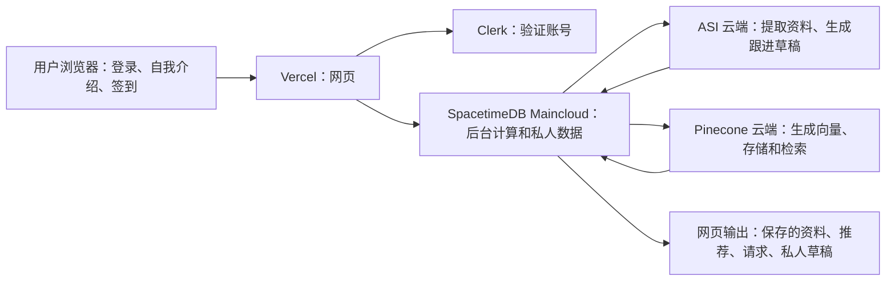

# 云端后端连接验收报告

验收时间：2026-10-04 00:53，America/New_York。

网页版的主要后台已经部署在 SpacetimeDB 云端，直接连接真实 ASI 和 Pinecone。使用这个网站不需要在你的电脑上启动 Python Agents 或 Node 网关。外部消息、录音、推送等功能仍未接通，不能把整个项目说成“全部完成”。

当前可用入口：[个人资料与连接](https://mhacks-live-map.vercel.app/chat)、[公开地图](https://mhacks-live-map.vercel.app/)。

## 在哪里运行，输入和输出是什么



浏览器接收自我介绍或 PDF/TXT。文件文本在浏览器中提取，最多发送 15,000 个字符，原始文件不入库；扫描版 PDF 没有 OCR。SpacetimeDB 校验登录账号后调用 ASI 提取信息，保存私人资料，再调用 Pinecone 建立向量索引。签到后，SpacetimeDB 从真实参与者数据计算原有 ROI 评分，返回推荐对象；对方接受连接后，可以调用 ASI 生成各自的私人跟进草稿。

ASI 模型 API 已接通。原仓库里的七个 Python/uAgents 进程没有被托管到 ASI 或 SpacetimeDB；网页版使用迁移后的原生云端业务函数。Agentverse/ASI:One 聊天入口是另外一条链路，目前尚未接入。

## 验收结果

| 功能 | 当前状态 | 验收证据或限制 |
|---|---|---|
| 网页部署、登录、私人资料 | 已接通 | 真实账号保存成功；刷新及再次部署后仍能恢复 |
| SpacetimeDB → ASI | 已实测 | Maincloud 内直接调用模型并收到有效回复 |
| SpacetimeDB → Pinecone | 已实测 | 1024 维向量；写入、fetch、query、测试记录删除均成功 |
| 真实账号向量 | 已实测 | 1 份私人资料状态为 indexed，对应 Pinecone 向量成功读取 |
| 签到、退出、匹配入口 | 已实测 | 网页签到后云端 presence 数量 0→1，退出后 1→0；当前没有其他签到者，匹配返回空列表 |
| 活动推荐 | 接口已实测，缺真实数据 | 云端活动库为 0；网页正确显示尚未发布活动 |
| 请求、接受/拒绝、跟进草稿 | 已部署、自动测试通过 | 已接上网页；尚未完成两个真实账号之间的端到端验收 |
| 跟进偏好、批准、结果记录、账号删除 | 原生云端接口已部署 | 权限和删除回归测试通过；偏好/批准/结果/删除目前没有网页按钮，实际删除未用你的账号测试 |
| 自动发送、推送、录音、Photon、Agentverse 聊天 | 未接通 | 见下一节 |

实际云端统计：地图账号 2、私人提取资料 1、活动 0、签到 0、连接记录 0、跟进计划 0。这些空数据说明尚无对应业务记录，不代表连接失败。

## 你需要补充什么

| 缺口 | 为什么还不能运行 | 下一步 |
|---|---|---|
| 真实活动 | 尚未导入活动目录 | 提供真实活动的标题、开始/结束时间、区域和主题，再通过管理员 `save_cloud_event` 导入；不要填演示数据当真实活动 |
| 双人完整流程 | 没有第二个已签到的真实参与者 | 让另一人登录、保存介绍并签到；验证推荐、发送请求、接受、生成各自草稿 |
| 自动邮件/其他外联 | `agents/integrations.py` 的 `send_outreach` 仍为未实现函数；云端只保存草稿 | 选定实际发送渠道，提供对应项目凭证和已验证发信身份，再实现发送及回执；现在可手动复制草稿发送 |
| 手机/浏览器推送 | `send_push` 仍未实现，也没有真实推送项目配置 | 选定推送服务、提供项目配置，并实现用户订阅与发送 |
| 录音和转写 | `start_recording`、`stop_recording`、`transcribe` 仍未实现；缺少实际音频采集和上传链路 | 提供 ElevenLabs 项目配置，并接上双方同意、浏览器录音、音频存储和转写；仅填 API key 不会完成录音 |
| Photon 消息 | `photon/.env` 未配置；现有桥接仍有 Spacetime 持久化 TODO，且旧 `AGENT_URL` 协议不是现在的登录协议 | 提供 `SPECTRUM_PROJECT_ID` / `SPECTRUM_PROJECT_SECRET`；实现可信消息身份与网站账号的绑定、云端适配和真实接收运行环境 |
| ASI:One / Agentverse 聊天 | 模型 API key 不会自动注册七个 Agent 身份或接通 mailbox | 若保留这个入口，需要注册/托管相应 Agent 并绑定身份与消息协议；仅使用当前网页版时不依赖这条链路 |
| 新域名 `mutuals.tech` | 当前浏览器报 DNS 无法解析；本机默认 DNS 仍返回旧权威记录 | 公共 DNS 1.1.1.1 已返回新 A 记录，Vercel nameserver 已匹配；使用该 IP 且保留 TLS 验证访问 `/chat` 返回 200。先用上面的 vercel.app 地址，等待 DNS 传播或清理相应 DNS 缓存；当前证据不需要修改后台代码 |

新域名于此次验收前约半小时加入 Vercel。新域名上的完整登录流程尚未实测；旧公开域名已完成账号验收。DNS 传播/缓存的判断依据见 [Vercel 官方域名排查说明](https://vercel.com/docs/domains/troubleshooting)。

## 发布和验证记录

- SpacetimeDB：`mhacks-live-map`，Maincloud。使用 `--delete-data=never` 发布，保留现有数据。
- 网页：Vercel 生产发布 `dpl_EcgpSV1VHHMmsDssuQ7un6zuCxCb`，状态 READY；[部署详情](https://vercel.com/terryzhu2024-8185/mhacks-live-map/EcgpSV1VHHMmsDssuQ7un6zuCxCb)。
- 本次最终验证：30 个模块/评分测试、17 个网页测试通过；网关类型检查、模块构建、网页生产构建通过。
- 真实匿名权限检查：私人资料读取、管理员探针均被拒绝；匿名 SQL 无法读取服务配置表。
- 服务凭证已配置到 SpacetimeDB 私有表，不进入网页 SDK 或前端资源。数据库管理员仍能读取私有表；这不等同于独立密钥管理服务。
- 未进行 Git commit/push；部署包含现有工作区代码。测试签到已退出，真实账号未被删除。PDF 上传及第二账号配对未做线上验收。

重新检查云端连接，可在仓库根目录运行：

```powershell
& 'C:\Users\TerryZhu\AppData\Local\SpacetimeDB\spacetime.exe' call mhacks-live-map verify_cloud_providers --server maincloud --yes
& '.\agents\.venv\Scripts\python.exe' '.\agents\check_cloud_state.py'
```

这两个检查使用现有管理员登录和本地配置，不需要把密钥贴到聊天里。服务实际运行在云端，检查脚本只是读取状态。

## 2026-10-04 简历解析补充验证

使用明确标注为合成测试资料的文字型 PDF，提取文字后，以当前后台的同一提取提示词调用真实 ASI1，成功返回 Rust、GraphQL 等结构化技能字段。这次直接模型检查没有写入用户账号。生产网页的 PDF worker 返回 HTTP 200 和正确的 JavaScript MIME 类型。

网页选文件的端到端检查仍未完成：Edge 的 ChatGPT 扩展未开启文件 URL 访问权限，自动化 `setFiles` 被拒绝，测试 PDF 没有附加或提交。该限制属于自动化工具；用户手动点击 Attach resume 不需要此扩展权限。网页支持文字型 PDF / UTF-8 TXT，大小不超过 10 MB；扫描件没有 OCR，DOCX 未支持。

公开网页验收截图保留在本地 `reports/cloud-backend-browser-proof.jpg`。它包含账号资料，不随代码上传 GitHub。
