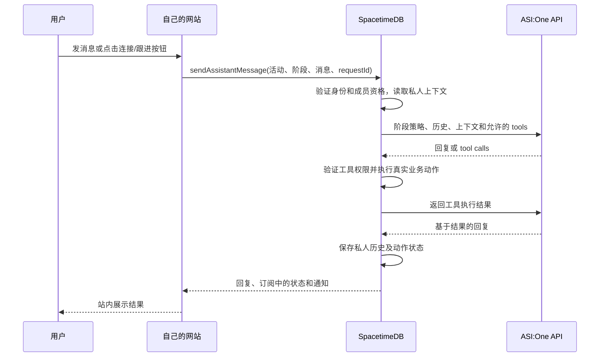

# 新增需求与实现对应报告

报告日期：2026-10-04。对象是你上一个实现 prompt 中新增的活动邀请、Pre 全员比较、站内三个助手、During GPS 与连接处理、Post 聊天界面，以及指定分支发布要求。

**主业务流程已经实现并上线：Terry 发布活动邀请 → 用户加入 → Terry 点击 Start 冻结名单 → 为每人生成匹配名单 → 用户在网站与三个助手聊天 → During 根据位置提醒并协助建立连接 → Post 准备私人跟进草稿。** 这份报告解释每个改动为什么对应你的需求，并区分已经实现的行为、实现时采用的默认规则和仍存在的差距。

有四个口径必须先说明：三个 Agent 目前是拥有独立职责、工具权限和历史的站内逻辑 Agent，没有部署成三个 Agentverse 独立进程；附近提醒由 SpacetimeDB 规则触发；连接请求需要用户点击或明确告诉助手发送；浏览器通知需要网页开启。如果你的要求还包括独立 Agentverse 注册、所有 GPS 判断也经过 ASI、无需用户指令自动发请求或关闭网页后的推送，这些部分不能标成已经满足。

## 1 报告依据与线上入口

实现分支是 [`feat/live-map-spacetimedb`](https://github.com/maiaPaperTowns/mutuals/tree/feat/live-map-spacetimedb)。功能实现提交为 [`0814ad2`](https://github.com/maiaPaperTowns/mutuals/commit/0814ad2d407fd9b45aab1c7586545972af34078c)，最后的运行代码修正为 [`4d6de65`](https://github.com/maiaPaperTowns/mutuals/commit/4d6de657ce009a740fb0cb14fad59068e252b007)。后续 `176b927` 是上线验收文档提交，没有改变运行代码。本报告的代码链接固定在 `4d6de65`，避免以后分支继续开发时改变证据。

| 入口或依据 | 用途 |
| --- | --- |
| [网站活动与助手](https://mhacks-live-map.vercel.app/events) | 看邀请、加入活动、管理员创建和开始活动、三个助手及通知 |
| [自定义域名入口](https://mutuals.tech/events) | 同一生产部署的活动页面；不同域名的登录状态可能不同 |
| [网站画像入口](https://mhacks-live-map.vercel.app/chat) | 保留简历和个人介绍流程，为参加活动准备画像 |
| [活动与站内助手实施说明](../docs/活动与站内助手实施说明.md) | 数据结构、接口、运行与发布方法 |
| [活动与助手上线验收](活动与助手上线验收.md) | 上一轮构建、测试、真实数据库与生产浏览器操作记录 |

本次写报告时再次只读核实：2026-10-04 07:06 UTC，两个 `/events` 入口都返回 HTTP 200；Vercel 生产部署 `dpl_48vFwtS9iiCM47aDtzdP2RYrfb53` 为 READY，两个域名都指向它；Maincloud 后端状态返回 ASI 与 Pinecone 配置存在。真实外部调用成功的证据来自上一轮上线验收，配置存在本身不等于重新测试过供应商可用性。

## 2 你的需求与实现逐项对应

表中“已实现”表示有对应代码和验收证据；“有边界”表示主功能存在，但需要按后文限定理解；“部分对应”表示仍有你可能要求、而当前没有实现的形态。实现时采用的数值规则不等于已经获得你对这些产品规则的单独批准。

| 你的新增需求 | 现在的对应行为 | 对应结论 |
| --- | --- | --- |
| Terry 是 admin，可以添加 event | Terry 的登录身份获得后端管理员权限；网站出现 Create an event 表单 | 已实现 |
| 创建 event 后在网站 post invitation | 保存活动即发布邀请卡片，包含标题、介绍、地点、时间和人数，并提供可复制链接 | 已实现；这里的 post 是站内邀请卡片 |
| 任何人点邀请后可以加入 | 访客能打开邀请；登录并完成画像索引后，自己点击 Join event 加入 | 已实现；加入需要可用于匹配的画像 |
| 可以持续加入，直到我点击开始 | OPEN 状态可加入或退出；管理员 Start 后后端拒绝新增加入和退出 | 已实现 |
| 开始后 list of people 固定 | Start 在事务中冻结成员名单及当时的画像；之后按这份快照比较 | 已实现；冻结画像也是本次采用的规则 |
| Pre 用 Pinecone 与每个人比较 | 在该活动专属 namespace 保存冻结向量，对每位参加者查询，并补齐每一对候选比较 | 已实现；范围是该活动冻结成员 |
| 算匹配程度或 ROI | 保存语义相似度、综合 Fit 和原有 ROI 评分；页面以 Fit / 100 展示排名 | 已实现；不把分数当作真实收益预测 |
| 每人得到 list of interest | 后端为每人保存自己的完整排序名单，排除本人，展示时过滤隐藏用户 | 已实现 |
| 首屏前 5 或 10 人，点击加载更多 | 默认 5 人，可选 10 人；Load more people 继续分页读取 | 已实现 |
| Pre、During、Post 都有网站聊天页面 | 一个站内工作区有三个可切换的 Agent 页签，各显示自己的对话 | 已实现；共享工作区，不是三个外部网站 |
| 所有聊天和 Agent request 通过 ASI:One API | 阶段聊天、请求连接、接受/拒绝、准备跟进按钮进入同一个 ASI 工具调用流程 | 已实现，有后端业务操作的边界 |
| 用户不应该去外部 AI 网站聊天 | 浏览器在自己的网站发消息和显示回复；由 SpacetimeDB 调用 ASI | 已实现 |
| 每个用户有 personalized 返回、记住 profile | 后端为该登录用户组装自己的画像、活动、名单、连接和近期阶段历史 | 已实现，有上下文长度边界 |
| During 管理 Pre 名单与星标 | During 读取原名单、查看连接、增删星标；地图突出星标用户 | 已实现，有前十提醒及前五十工具读取边界 |
| 地图发现感兴趣或星标的人在附近就 notification | 位置或签到等状态更新时，后端判断前十推荐及全部星标对象是否满足靠近条件 | 已实现，有 GPS 与通知渠道边界 |
| 尝试建立联系、处理连接请求拒绝等 | 提醒和名单有 Request connection；接收方 Accept/Decline；双方状态和通知同步 | 已实现辅助联系；不会自动替用户发请求 |
| Post 保留现有功能，加 Agent interaction interface | 已接受连接可以通过 Post 聊天或按钮准备草稿、解释渠道时间、修改聊天中的措辞 | 已实现；正式草稿不会自动发送 |
| 后端尽量全部 SpacetimeDB，Vercel 前端 | 新业务、私人状态、工具执行和位置过期调度在 Maincloud；前端部署在 Vercel | 已实现；ASI/Pinecone 是外部能力 |
| 必须有独立 Agent | 三份独立角色配置、工具集合与分阶段历史，在同一原生后端执行 | 部分对应；没有三个 Agentverse 独立服务 |
| 只改 feat live map 分支，推 GitHub、部署 | 仅推送指定分支；前端和原生后端已发布并验收，未合并其他分支 | 已实现 |

## 3 Pre：从活动邀请到每个人的匹配名单

### 3.1 把“全员”限定为你开始活动时确定的参加者

你补充解释后，Pre 的目标已经很明确：管理员先收集参加者，再固定名单，最后让名单里的每个人获得自己的推荐。这次新增的活动流程按这个顺序实现，而不是拿整个平台的所有账号直接推荐，也不是继续用“推荐去参加哪个活动”来代替你的新需求。

Terry 登录后可以填写活动标题、介绍、地点和计划时间。提交后，活动出现在网站的 Event invitations 中，其他人可以直接打开，也可以收到你复制的 `/events?event=活动ID` 链接。创建权限由服务器检查登录身份是否在 `cloud_admin` 中；把自己的显示名改成 Terry 不会获得权限。

邀请内容可以公开查看，实际加入需要登录且已有完成索引的画像。这个条件让后续比较有真实输入：没有简历也可以使用个人介绍流程，但必须先生成有效的画像向量。这里没有增加由管理员替别人报名的路径，加入是每个用户自己的操作。

活动有两个关键状态：`open` 和 `started`。计划时间只用于活动展示，当前真正关闭报名的动作是 Terry 点击 **Start event and lock roster**。开始前能加入或退出；开始后不能通过报名接口修改成员名单。账号删除仍有自己的隐私清理流程，因此“冻结”不能理解成永远阻止一个人删除账号。

Start 还保存当时的画像快照。这样某人在活动开始后修改简历，不会导致同一轮推荐有人按旧画像比较、有人按新画像比较。当前助手聊天可以读取该用户最新的个人画像，但这轮排名仍按活动开始时的快照计算；二者的时间口径是有意区分的。

源码依据：[活动创建、加入与冻结](https://github.com/maiaPaperTowns/mutuals/blob/4d6de657ce009a740fb0cb14fad59068e252b007/map/spacetimedb/src/index.ts#L1409)、[网站邀请和 Start 操作](https://github.com/maiaPaperTowns/mutuals/blob/4d6de657ce009a740fb0cb14fad59068e252b007/map/src/NetworkingWorkspace.tsx#L189)。

### 3.2 Pinecone 确实参与比较，并保留全员覆盖

已有的画像流程会提取结构化资料，并使用 Pinecone 生成和保存 1024 维向量。新增流程复用这些向量，在开始活动后把冻结成员的向量放入 `networking-活动ID` namespace，避免不同活动、未参加活动的账号或后来更新的普通画像混入本轮检索。

准备过程对每个参加者调用 Pinecone query，然后遍历其他冻结成员生成结果。自己不会成为自己的推荐。如果 Pinecone 暂时没有返回某位成员，或者人数超过一次 query 的候选上限，服务器使用同一份冻结向量计算精确 cosine 补齐，保证每个人都被比较。这不是只拿检索返回的少数人、再宣称已经比较全员。

有 \(n\) 名参加者时，每个人拥有 \(n-1\) 个候选，数据库保存 \(n(n-1)\) 条有方向的比较结果。同一对人的语义相似度可以相同，但各自目标产生的业务评分和优先顺序可能不同，因此两个人有各自的名单。

计算按每批最多 10 位参加者推进，并显示已经准备了多少份名单。中断后管理员可以点击 Resume preparing matches 继续处理已有进度；不会为了恢复计算而重新开放报名。没有其他参加者时，名单为空，系统不会制造假人。

这个设计满足你要求的覆盖，但全员比较本身有平方增长的计算和存储成本。本次没有做大型活动的容量或费用压测，不能仅凭小规模验收承诺任意人数下都能迅速完成。

源码依据：[活动向量、逐人查询、全员补齐和批量恢复](https://github.com/maiaPaperTowns/mutuals/blob/4d6de657ce009a740fb0cb14fad59068e252b007/map/spacetimedb/src/index.ts#L1459)。

### 3.3 你说的“ROI，或者匹配程度”最终怎么展示

当前页面展示的是 **Fit / 100**，用于回答“这个人对我这次 networking 有多值得优先接触”。后端还保存语义相似度和原有 ROI 评分，二者没有被混成同一个名词。

本次采用的 Fit 规则是：65% 来自画像向量相似度，35% 来自目标、技能与资历适配。在后者内部，目标占 50%，技能占 25%，资历占 25%。等价公式是 \(Fit=100[0.65S+0.35(0.5G+0.25K+0.25L)]\)，其中 \(S\) 是截断到 0 至 1 的向量相似度，其他项来自现有评分函数；结果保留一位小数。

这些权重是实现时采用的初始规则，**没有经过真实活动效果校准，也不是你已经逐项批准的评分标准**。保留目标与技能项，是为了不把“简历很像”直接当成“最值得见面”；但现阶段同样不能把 Fit 或原有 ROI 当作实际获得工作机会、招聘成功或金钱收益的概率。

每张推荐卡片显示排名、姓名、角色、区域、Fit 和推荐理由；在有效 GPS 条件下还能显示距离。页面没有把原始向量、对方完整简历或私人聊天公开出来。姓名和区域在接受连接前就可以展示，这对应你已经确认的“可发现用户提前显示姓名和区域，接受后建立连接”。尚未签到时，区域会显示未签到，而不是伪造位置。

### 3.4 完整名单与首屏 5/10 的关系

名单在服务器完整保存，首屏展示数量是网页的分页设置。默认显示 5 人，也可以改成 10 人；Load more people 继续加载后续候选。因此“先看十个人”和“只比较十个人”在当前实现中是两件不同的事。

显示名单时还会检查目标现在是否可被发现。一个人在开始后关闭可发现状态，会从网页候选投影中隐藏；这是发现权限的变化，不是重新计算参加者名单或开放报名。用户的星标按“当前用户 + 当前活动 + 目标”保存，加载更多或刷新页面后仍然有效。

源码依据：[私人名单读取和星标](https://github.com/maiaPaperTowns/mutuals/blob/4d6de657ce009a740fb0cb14fad59068e252b007/map/spacetimedb/src/index.ts#L1518)、[推荐卡片与分页](https://github.com/maiaPaperTowns/mutuals/blob/4d6de657ce009a740fb0cb14fad59068e252b007/map/src/NetworkingWorkspace.tsx#L209)。

## 4 三个助手怎样在你的网站与用户 interaction

### 4.1 用户始终留在自己的站内工作区

用户加入活动后，在同一个工作区切换 Pre、During、Post 页签。每个页签都有自己的助手介绍、历史消息、输入框、示例提示和处理中的状态，左侧显示该阶段相关的名单、地图或跟进内容。当前阶段和活动写进 URL，刷新后能保持所选入口。

这个界面对应你要的“像助手”：用户既能用自然语言提出目标，也能用名单和通知中的按钮发起明确动作；动作结果通过聊天回复和持久通知返回。用户不需要跳转到 ASI:One 网站，不需要持有 ASI API key，也不会在别人的聊天页面完成主流程。

通知是独立的网站收件箱，不只是一条可能被聊天消息淹没的回复。靠近提醒、收到连接请求以及对方接受或拒绝会写入自己的通知记录。用户可以查看并标为已读；打开网页时，订阅会同步新的记录。

源码依据：[三个阶段和站内聊天面板](https://github.com/maiaPaperTowns/mutuals/blob/4d6de657ce009a740fb0cb14fad59068e252b007/map/src/NetworkingWorkspace.tsx#L207)、[私人通知界面](https://github.com/maiaPaperTowns/mutuals/blob/4d6de657ce009a740fb0cb14fad59068e252b007/map/src/NetworkingWorkspace.tsx#L182)。

### 4.2 聊天和 Agent 动作真正经过 ASI API

需要执行工具动作的一次阶段对话，实际路径如下；纯文本回复可以直接保存并返回：

后端调用的是 `https://api.asi1.ai/v1/chat/completions`，模型为 `asi1`。ASI 负责理解、生成回复和提出工具调用；后端负责执行工具并再次检查权限。助手不能仅凭文本声称“我已连接好了”，提示词要求它依据实际工具结果回答。

Request connection、Accept、Decline 和 Prepare follow-up 按钮都转换成含目标或连接 ID 的明确消息，进入上述 ASI 流程。因此这些按钮与用户手打“帮我发送请求”共享执行入口，不是聊天只负责说话、按钮悄悄走另一套业务逻辑。

对短暂 ASI HTTP 5xx，服务器最多自动重试一次。网页重试同一消息会复用 requestId，服务器保存已执行工具的结果，避免在回复失败之后把同一次已成功动作重复执行。鉴权错误不会被当成暂时 5xx 无限重试。

**边界：并非每个业务操作都经过 ASI。** 创建、加入、Start、批量 Pinecone 比较、GPS 上报、签到、卡片上的星标和标记通知已读直接进入 SpacetimeDB；自动靠近判断也不调用模型。聊天里提出星标要求则可以通过 ASI 的 `set_star` 工具处理。如果“所有 agents 处理的 request”还意味着这些确定性的操作也必须先请求 ASI，当前实现没有严格覆盖这个更宽的口径。

源码依据：[网站动作进入聊天](https://github.com/maiaPaperTowns/mutuals/blob/4d6de657ce009a740fb0cb14fad59068e252b007/map/src/NetworkingWorkspace.tsx#L149)、[ASI 请求、工具循环与幂等](https://github.com/maiaPaperTowns/mutuals/blob/4d6de657ce009a740fb0cb14fad59068e252b007/map/spacetimedb/src/index.ts#L1704)。

### 4.3 三个 Agent 的职责与“独立”的实际含义

| Agent | 当前处理的用户需求 | 可以使用的工具 | 示例用户输入 |
| --- | --- | --- | --- |
| Pre | 解释匹配、结合目标安排优先顺序、准备介绍、管理星标；未开始时解释名单还未冻结 | `get_interest_list`、`set_star` | “我想找做 AI 产品的合作伙伴，先见谁？” |
| During | 读取名单与位置、解释靠近提醒、管理星标、发连接请求、接受或拒绝收到的请求 | `get_interest_list`、`get_connections`、`set_star`、`request_connection`、`respond_connection` | “把这个附近的人加入星标，再给他发请求。” |
| Post | 查看自己的连接、准备私人跟进草稿、解释渠道和时间、在聊天中调整措辞 | `get_connections`、`prepare_followup` | “帮我给已经接受连接的这位准备一段简短跟进。” |

独立性体现在三份角色策略、不同工具白名单和分开的阶段历史。Pre 不能使用 During 的连接工具，Post 不能替 During 发请求。它们共享同一个 SpacetimeDB 服务和 ASI 模型 API，切换阶段不是新建第三方聊天账号。

所以，当前实现满足“三个有不同职责和动作能力的站内助手”，但不等价于“把已有的三个 Agentverse/uAgents 服务迁移并分别注册”。旧 Python/uAgents 和 Photon 路径仍保留，生产状态中 `agentverse_chat` 是 `not_connected`。你更早提出过独立 Agent 的要求，这个部署形态上的差距必须保留在报告中，不能因为已经有三个页签就写成完全相同。

另外，阶段目前可以由用户切换，不是到了某个时间才自动开放 Post；实际动作仍受业务条件限制，例如没有已接受连接就不能生成跟进草稿。

源码依据：[三份 Agent 策略、工具集合和共同约束](https://github.com/maiaPaperTowns/mutuals/blob/4d6de657ce009a740fb0cb14fad59068e252b007/map/spacetimedb/src/assistantAgents.ts#L11)、[服务器阶段工具检查](https://github.com/maiaPaperTowns/mutuals/blob/4d6de657ce009a740fb0cb14fad59068e252b007/map/spacetimedb/src/index.ts#L1671)。

### 4.4 “记住 profile”和 personalized 的具体实现

每次调用，服务器从当前登录身份确定本人，再加入自己的结构化画像、活动信息、签到状态、前十候选、自己的连接以及该活动该阶段最近 12 条历史消息。画像 embedding 不放进模型上下文。这样同一句“我应该先见谁”，不同用户会得到基于各自目标和名单的输入，而不是所有人共享一段通用回答。

历史按用户、活动、阶段保存到 SpacetimeDB；刷新网页不会丢失已经保存的对话。私人会话和通知通过按当前身份过滤的视图读取，另一个用户不会获得本人消息。用户可以看可发现对象的推荐投影，但不能借此读取对方的完整简历、私人会话或向量。

这里的记忆有明确上限：数据库保存的历史与一次模型请求的上下文不是同一个范围。模型一次只使用最近 12 条该阶段历史，初始推荐上下文是前十；`get_interest_list` 工具目前最多返回前五十个可发现候选，没有为 Agent 提供继续向后分页的参数。网页能继续加载完整名单，但不能声称助手一次已经看过任意大活动的所有候选，或永久记得全部对话细节。

源码依据：[私人消息与通知视图](https://github.com/maiaPaperTowns/mutuals/blob/4d6de657ce009a740fb0cb14fad59068e252b007/map/spacetimedb/src/index.ts#L1385)、[上下文和最近历史组装](https://github.com/maiaPaperTowns/mutuals/blob/4d6de657ce009a740fb0cb14fad59068e252b007/map/spacetimedb/src/index.ts#L1712)。

## 5 During：让推荐对象变成可以联系的人

### 5.1 接续 Pre 名单，不重新变成全场随机推荐

During 使用 Pre 已经保存的活动名单，并保留用户星标。因此它服务的是“我已经有兴趣见这些人，现场怎样更快见到他们”，而不是每次打开地图都从头推荐一批无关对象。

用户先选择区域、空闲状态和是否可被发现，再 Check in。区域是人工选择的活动标签；GPS 是浏览器定位，两者分开处理。区域标签可以帮助说明“在哪个区域”，但相同区域不等于证明两个用户真的距离很近。当前区域来自已有选项，创建活动时没有新增自定义室内区域编辑器。

地图显示当前活动中具备有效位置的可发现成员，星标对象显示 ★；名单中的 Find on map 可以聚焦到对应位置。名单不是地图全部成员的同义词：地图可见成员可能比优先推荐对象更多，而附近提醒只关注规定的兴趣对象。

用户自行启用 Share event GPS，并授予浏览器定位权限。没有启用定位或没有有效坐标时，助手仍可以解释名单和处理允许的请求，但不能声称某个人就在附近。

源码依据：[签到与活动发现状态](https://github.com/maiaPaperTowns/mutuals/blob/4d6de657ce009a740fb0cb14fad59068e252b007/map/spacetimedb/src/index.ts#L1603)、[GPS 地图与分享控制](https://github.com/maiaPaperTowns/mutuals/blob/4d6de657ce009a740fb0cb14fad59068e252b007/map/src/EventGpsMap.tsx#L17)。

### 5.2 什么条件下会生成 notification

后台判断每位已签到用户在冻结排序中的前十推荐，以及该活动中所有星标对象。下列条件同时成立才生成靠近提醒：

| 判断项 | 当前规则 | 对用户的影响 |
| --- | --- | --- |
| 兴趣关系 | 对方在本人冻结排序前十或星标中 | 原始排名超出前十的对象需星标后才纳入提醒 |
| 双方状态 | 当前活动成员，可发现，签到在最近五分钟内，双方都 Free to talk | Busy、In a session、隐藏或离线时不触发靠近提醒 |
| GPS 有效性 | 双方坐标最近两分钟内更新，报告精度均不超过 100 米 | 旧位置或精度差不会被当作实时附近 |
| 距离 | 计算距离不超过 100 米 | 根据实际坐标判断，不靠模型猜测 |
| 已有连接状态 | 同活动内尚未请求、接受、记录或拒绝过该对象 | 不反复催促已经处理过的同一对人 |
| 重复提醒 | 同对象靠近提醒至少间隔五分钟 | 降低连续位置更新造成的重复通知 |

这些数值是本次实现默认值，不是已经验证最适合所有会场的产品参数。尤其是“100 米以内且精度不超过 100 米”只能支持粗略靠近提示，不能承诺走到对方身边的室内精确导航。

靠近判断在 GPS、签到或星标等状态改变时运行，通知写入服务器。它没有启动一个持续询问 ASI 的后台聊天循环。During Agent 可以读取名单中的有效距离、解释情况并使用连接工具；自动位置监测是它背后的确定性业务能力。

源码依据：[新鲜签到与位置判断](https://github.com/maiaPaperTowns/mutuals/blob/4d6de657ce009a740fb0cb14fad59068e252b007/map/spacetimedb/src/index.ts#L1553)、[兴趣对象、距离与通知规则](https://github.com/maiaPaperTowns/mutuals/blob/4d6de657ce009a740fb0cb14fad59068e252b007/map/spacetimedb/src/index.ts#L1577)。

### 5.3 从提醒到请求、接受或拒绝

靠近通知带有 Request connection 按钮。用户也可以直接在 During 聊天里要求发送，或者在推荐卡片上点击请求。这三种入口最终都让 ASI 提出 `request_connection`，后端确认同活动成员身份、有效签到和发现资格后创建 `requested` 记录，并通知接收方。

接收方可以通过通知或连接卡片 Accept/Decline，也可以向 During 明确提出处理请求。只有收到请求的人能作出响应；管理员或请求发起人不能替接收方接受。接受后状态为 `accepted`，才算建立连接；拒绝为 `declined`，不会进入可生成草稿的已连接状态。发起人会收到对应结果通知。

连接状态有活动范围，同一对人在另一场活动中的请求不会被错误地当作本场请求。同活动已有请求或其他处理状态时，不重复创建相同关系。发送请求不要求对方一定出现在本人前十，也不要求 GPS 距离必须小于 100 米；这些条件是自动靠近提醒的限制，不是所有联系行为的限制。

“尝试建立联系”当前实现为 **提醒 + 明确操作入口 + Agent 执行请求 + 双方反馈**。系统不会因为两人靠近就未经用户指令自动发送。提示词要求用户明确提出修改类动作，后端则检查身份和业务权限；后端没有单独的自然语言意图判定器来保证模型永远正确理解授权。若你希望完全自动代发，当前还不能算实现了这种模式。

源码依据：[发送及响应连接](https://github.com/maiaPaperTowns/mutuals/blob/4d6de657ce009a740fb0cb14fad59068e252b007/map/spacetimedb/src/index.ts#L1639)、[按钮通过 ASI 处理](https://github.com/maiaPaperTowns/mutuals/blob/4d6de657ce009a740fb0cb14fad59068e252b007/map/src/NetworkingWorkspace.tsx#L165)。

### 5.4 通知和 GPS 生命周期的边界

通知有两层：SpacetimeDB 中持久保存的私人网站收件箱，以及用户允许后、网页开启时显示的浏览器即时通知。网页关闭后不提供 Web Push；“保存了 notification”不能理解成手机锁屏时一定收到系统推送。

停止分享、签退或关闭可发现状态会清理自己的活动 GPS；离开 During 地图组件也停止分享。服务器还会在断开连接时清理，并通过调度记录删除超过两分钟的坐标，避免把离场的人留在地图上。旧签到超过五分钟不再算有效在线状态。

当前地图提供位置点、距离、星标和区域标签，没有室内楼层定位、路线规划或会场硬件定位。手机和浏览器能否持续提供 GPS、室内精度是否足够，需要在实际会场单独验证。

## 6 Post：保留跟进功能，把入口接到助手

你说 Post 功能看着没问题，主要缺一个 Agent 与用户交互的界面。这次复用原生跟进逻辑，为它增加 Post 页签和 ASI 工具入口，没有把它扩展成未经要求的自动邮件发送服务。

用户可以在已接受连接的卡片点击 Prepare follow-up，或在 Post 里要求准备草稿。助手先读取自己的连接，再通过 `prepare_followup` 调用后端。服务器确认该连接属于本人且处于 accepted/recorded 状态，结合双方画像和可共同使用的跟进渠道，生成或读取跟进计划。

网站展示本人可见的草稿、渠道、建议时间和理由。草稿按本人投影读取，不能直接看到对方的私人草稿；计划带活动标识，避免同一对人在不同活动的内容串到一起。双方没有共同允许的渠道时，返回无法形成渠道的结果，不会假造联系方式。

用户可以要求 Post “短一些”“更自然”“强调合作方向”。这种编辑返回在聊天里；当前正式草稿卡片是只读展示，聊天里的新措辞不会自动覆盖数据库中的原草稿。用户可复制聊天里的修改稿，或点击 Copy draft 复制卡片上的原稿，再自行审阅发送。

因此 Post 满足“在自己的网站通过助手交互并准备个性化跟进”，尚不提供邮箱/LinkedIn 实际投递、自动发送、送达状态或草稿版本自动回写。生产后端的 `outbound_delivery` 仍为 `not_connected`。

源码依据：[跟进生成、渠道和本人草稿投影](https://github.com/maiaPaperTowns/mutuals/blob/4d6de657ce009a740fb0cb14fad59068e252b007/map/spacetimedb/src/index.ts#L1250)、[Post 入口与草稿卡片](https://github.com/maiaPaperTowns/mutuals/blob/4d6de657ce009a740fb0cb14fad59068e252b007/map/src/NetworkingWorkspace.tsx#L225)。

## 7 这些改动如何 fit 你的技术栈要求

| 责任 | 当前放在哪里 | 为什么对应你的要求 |
| --- | --- | --- |
| 网站布局、表单、聊天、地图、浏览器定位和通知显示 | React 前端，Vercel 托管 | Vercel 提供用户界面；没有把新增业务搬到 Vercel API 后端 |
| 身份权限、活动状态、成员冻结、排序保存、星标、GPS、连接 | SpacetimeDB Maincloud 原生模块 | 主要业务处理集中在你要求的 SpacetimeDB |
| 聊天历史、通知、正在处理的请求与重复动作防护 | SpacetimeDB 私人表和按身份过滤的视图 | 每个用户的数据和后台动作有统一状态来源 |
| 位置过期清理 | SpacetimeDB 调度 reducer | 不需要额外服务器或 Vercel cron |
| 画像向量、活动向量检索 | 后端调用 Pinecone | 使用你明确指定的向量能力；结果回到 SpacetimeDB |
| 画像理解、三个阶段回复、工具选择与跟进生成 | 后端调用 ASI:One API | 网站拥有自己的聊天入口，ASI 提供模型能力 |
| 登录与地图底图 | 既有 Clerk 登录、OpenStreetMap 瓦片 | 保留现有外部能力，不声称 SpacetimeDB 取代浏览器定位或地图服务 |

新增九张私有底层表覆盖活动、成员、兴趣名单、星标、位置、位置过期调度、助手消息、助手通知和助手请求处理记录。不是创建三套互不知情的 Pre/During/Post 数据库：三个阶段共享活动业务状态，但聊天历史按阶段隔离。

ASI 和 Pinecone key 保存在后端配置；浏览器调用已认证的 SpacetimeDB 接口，不能取得这些供应商 key。原有 Python/uAgents、gateway 和 Photon 代码不是生产站内新流程所依赖的额外业务服务器，也没有因为仓库仍有这些目录就声称它们已经部署。

源码依据：[新增私人数据表](https://github.com/maiaPaperTowns/mutuals/blob/4d6de657ce009a740fb0cb14fad59068e252b007/map/spacetimedb/src/index.ts#L201)、[数据流和接口实施说明](../docs/活动与站内助手实施说明.md)。

## 8 发布、验证和证据能够证明到什么程度

本次实现只在 `feat/live-map-spacetimedb` 完成并推送，没有合并其他分支。运行代码发布到原有 Vercel 项目 `mhacks-live-map`，原生模块发布到原有 Maincloud 数据库 `mhacks-live-map`，使用 `--delete-data=never` 保留生产数据。GitHub 可见代码改动，网站可见新工作区，后端也已经同步；不是只有本地截图或一个前端构建。

验收证据分成以下几层，不把其中一层说成另外一层：

| 证据层 | 已完成的验证 | 能证明什么；不能证明什么 |
| --- | --- | --- |
| 前端自动检查 | 完整测试 20/20；最终相关测试 3/3；生产构建通过 | 加入、分页、星标、消息失败后的输入保留和重试等界面行为；不是现场 GPS 实验 |
| 后端自动检查 | 模块与评分回归 42/42，类型检查、原生模块构建、SDK 生成通过 | 管理员权限、冻结、八人全员排序、私人历史、工具权限、通知规则、幂等和清理等逻辑 |
| 真实本地 SpacetimeDB | 两位合成参加者及一个外部身份；实际订阅、权限、请求响应、草稿、GPS 停止、调度过期和断线清理通过 | 原生数据库和 SDK 中的业务流程确实运行；外部 provider 使用测试 adapter，不代表真实供应商 |
| 生产外部能力 | Maincloud 探针实际 ASI 调用、Pinecone 1024 维向量写入/读取/query，并确认清理 | 已有生产凭据和外部调用路径能工作；不代表所有未来请求永不失败 |
| 生产网站实际操作 | Terry 创建临时邀请、加入、Start 锁定、完成 1/1；三个阶段分别通过真实 ASI 返回中文，并使用读取工具；刷新保留历史 | 网站、原生后端和供应商链路接通；只有一位参加者，不能当作生产多人匹配或真人靠近实验 |
| 当前只读复核 | 两个活动 URL HTTP 200、Vercel READY、Maincloud 配置状态 | 本报告编写时线上入口与既有部署仍在；没有重新执行整套业务或付费 provider 探针 |

生产验收没有虚构参加者：那场临时活动只有 Terry，推荐数正确地为零。多人排序、连接和位置流程有自动检查及真实本地数据库证据，但没有登录其他人的生产账号来凑出“真人端到端”结果。临时邀请、测试会话和活动向量 namespace 已精确清理，原有账号保留。

生产首次 ASI 请求曾遇到 HTTP 500，重试成功后增加了一次有界自动重试，并检查不会重复执行已成功工具。这个修正对应的是“网站上的助手可以可靠处理暂时失败”，不意味着已承诺供应商可用性 SLA。

发布和具体操作证据见 [活动与助手上线验收](活动与助手上线验收.md)；可复查的测试包括 [后端模块测试](https://github.com/maiaPaperTowns/mutuals/blob/4d6de657ce009a740fb0cb14fad59068e252b007/agents/spacetime-gateway/test/module.test.ts)、[真实数据库集成](https://github.com/maiaPaperTowns/mutuals/blob/4d6de657ce009a740fb0cb14fad59068e252b007/agents/spacetime-gateway/test/networking-integration.ts)、[网站工作区测试](https://github.com/maiaPaperTowns/mutuals/blob/4d6de657ce009a740fb0cb14fad59068e252b007/map/test/networking-workspace.test.tsx)。

本报告是文档改动，按仓库既有发布规则提交并推送文档，核实已有部署，不重新发布没有改变的运行代码。

## 9 用一条用户旅程检查需求是否接上

下面是说明实现关系的假设例子，不是声称已经发生的生产真人测试。

1. Terry 发布一个 networking 活动，复制邀请链接；小王和小李打开自己的网站，登录并准备画像后加入。
2. 小王加入时，不需要立刻知道全部参加者；名单仍然开放。Terry 确认人都到齐后点击 Start，后续访客不能再加入这一轮。
3. 系统用冻结画像生成每个人的完整排名。小王先看前五名，可以加载更多；他给小李加星标，并问 Pre 为什么值得优先见。
4. 到活动现场，两人进入 During，签到、设为 Free to talk、选择可发现并自愿分享 GPS。小李满足有效位置和 100 米规则时，小王收到靠近通知。
5. 小王在通知上点击 Request connection，网站把明确请求送入 ASI 流程；后端创建请求，小李收到通知。小李接受后，两人的状态变成 Connected；拒绝则只记录拒绝状态。
6. 小王切到 Post，要求给已接受连接的小李准备跟进。Post 返回自己的草稿和建议，他再通过聊天调整措辞，最后自行复制并发送。

这条旅程把你的需求连接成同一个系统：Pre 决定值得见谁，During 在现场提供位置机会和连接处理，Post 接续已经建立的关系。画像、活动、星标、请求与跟进都有共同的后端状态，三个聊天页签不是脱离这些数据的三个文本机器人。

## 10 需要保留在需求记录中的差距与默认值

| 项目 | 当前实现口径 | 应如何记录 |
| --- | --- | --- |
| 独立 Agent 部署 | 三个逻辑角色，同一原生后端与 ASI API；未注册三个 Agentverse 服务 | 功能职责已实现，独立外部服务形态尚未实现 |
| ASI 覆盖所有处理请求 | 聊天与连接/跟进助手动作经过 ASI；GPS、匹配等业务直接在后端处理 | 按站内助手请求口径满足；按每一项后台处理都经过 ASI 的口径有差距 |
| “Agent 管理全名单” | 后端完整名单、网页完整分页；模型初始前十，工具最多前五十 | 超过五十人的后段候选没有 Agent 分页读取能力 |
| 兴趣对象附近提醒 | 自动监测前十推荐和全部星标 | 不是未星标的完整名单都自动提醒；默认策略待产品确认 |
| 自动尝试联系 | 提醒后由用户明确发起，助手执行 | 辅助联系已实现，无指令自动代发尚未实现 |
| 关闭网页通知 | 持久网站收件箱；网页开启且许可后浏览器提醒 | Web Push 尚未实现 |
| 现场定位效果 | 浏览器 GPS、粗略距离、区域标签和地图点 | 未完成真人会场验证，无室内精确定位或路线规划 |
| 长期记忆 | 历史持久保存，模型使用最近十二条该阶段消息和当前资料 | 不能承诺无限上下文或跨阶段完整语义记忆 |
| Post 编辑 | 聊天可返回修改措辞，卡片展示已保存草稿 | 尚无聊天修改自动回写正式草稿版本 |
| 产品参数 | Fit 权重、前十提醒、100 米、两分钟、五分钟等 | 都是本次实现默认值，不能写成你已经批准或实测最优 |
| 规模与效果 | 小规模功能与链路检查通过 | 大型活动成本、速度、实际节省时间和匹配效果尚未测量 |

因此可以把活动邀请、冻结成员、Pinecone 全员比较、每人名单与分页、站内阶段聊天、GPS 条件提醒、连接接受/拒绝、Post 助手入口、SpacetimeDB 主后端和指定分支上线标为已有实现；上述形态差距和产品默认值应继续明确记录，不能仅凭“页面能打开”就标成所有需求完全一致或已经获得最终需求批准。
